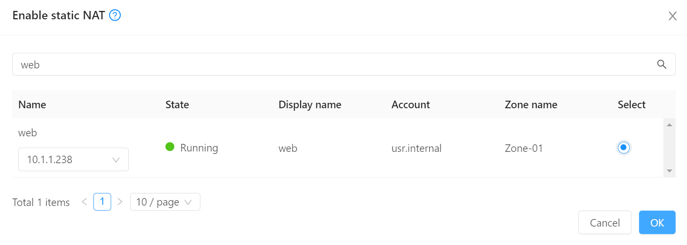

# Compute e Networking

## Login

Para começar, acesse [o painel do CloudStack](https:/lwsa.cloud) e forneça as credenciais que recebeu.

Use a aba "Single Sign-On" se estiver acessando via SAML.

## Chaves SSH

Para poder logar-se nas instâncias, crie um chave SSH e cadastre-a no painel.

1. No menu de navegação à esquerda clique em __Compute__, __SSH key pairs__
2. Clique no botão __Create a SSH Key Pair +__
3. Verifique se possui a chave criada na sua estação:
```bash
cat ~/.ssh/id_rsa.pub
```
Caso ainda não possua, para criá-la:
```bash
ssh-keygen
cat ~/.ssh/id_rsa.pub
```

Copie todas as linhas de saída do comando _cat_ e cole no campo __Public key__. Escolha um nome como _minha-chave_ e clique OK.


## Rede

Usualmente como em clouds públicas, as instâncias são instaladas em redes com endereços IP privados (exemplo `10.x.x.x`) e acessadas via _port forwarding_ ou _load balancing_.

A rede que você criará ficará totalmente isolada de todas as demais redes de outros clientes, sendo possível a comunicação somente através da saída por IPs públicos e desde que permitida por regras de firewall.

Para criar a rede:

1. No menu de navegação à esquerda clique em __Network__, __Guest networks__
2. Clique no botão __Add network +__
3. Em __name__ coloque um nome como _minha-rede_
4. Em __Network offering__ escolha `ISOLATED Network VXLAN with Single VR`
5. Os demais campos podem ficar em branco. Clique OK.

## Criando a instância

1. No menu de navegação à esquerda clique em __Compute__, __Instances__
2. Clique no botão __Add instance +__
3. Em __Templates__, escolha __Community__, digite _ubuntu_ na busca e escolha __Ubuntu-Server-22-LWSA__ 

4. Em __Compute offering__ escolha __LWSA.micro__
5. Em __Data disk__ mantenha __No thanks__
6. Em __Networks__ escolha a rede que criou, _minha-rede_
7. Em __SSH key pairs__ escolha a chave criada no passo anterior, por exemplo, _minha-chave_

8. Coloque o nome _web_ e clique __Launch instance__


## Conectando à internet

Para que a instância criada possa se comunicar com o mundo externo, os próximos passos são:

- Criar regras de _firewall_ restringindo a conexão a origens específicas
- Associar um endereço IP público e porta via _Static NAT_

### Firewall

1. No menu de navegação à esquerda clique em __Network__, __Guest networks__ e clique na rede criada, ex. _minha-rede_
2. Ao clicar na aba __Egress rules__ pode-se verificar se o tráfego de saída para a internet é, ou não, liberado por padrão. Caso a política (_default egress policy_) seja _Deny_ devemos liberar o tráfego de saída:

3. Na aba __Public IP addresses__ vemos que já há um primeiro IP associado e marcado como _source-nat_. Isto indica que tráfego originado de dentro da rede para a internet terá este IP como origem.

4. No menu à esquerda acesse __Networks__, __Guest networks__, _minha-rede_, __Public IP addresses__ e clique __+ Acquire new IP__. Escolha qualquer IP livre.

5. Clique sobre o novo IP escolhido (exemplo: `xIP_WEBx`). Clique na aba __Firewall__ e crie as seguintes regras:
    1. __Source CIDR__: _0.0.0.0/0_; __Start port__: _80_; __End port__: _80_ (para aceitar conexões HTTP)
    2. __Source CIDR__: _0.0.0.0/0_; __Start port__: _443_; __End port__: _443_ (para aceitar conexões HTTPS)
    3. __Source CIDR__: _0.0.0.0/0_; __Start port__: _22_; __End port__: _22_ (para aceitar conexões SSH num range de portas).
    4. __Source CIDR__: _0.0.0.0/0_; __Protocol__: _ICMP_ (para testarmos _ping_).

!!! info
    Poderíamos restringir origens para cada uma dessas portas. Por exemplo, poderíamos permitir origens SSH somente para uma origem específica, como um _jump server_.


### Static NAT

Uma vez configurado qual tráfego permitir, falta direcioná-lo ao destino desejado. Existem 3 formas diferentes de configurar o tráfego para o endereço IP:

- Static NAT
- Port Forwarding
- Load Balancing

A forma mais simples e direta de associar um endereço IP a uma instância é via _Static NAT_, onde todo o tráfego recebido no IP é direcionado sempre à mesma instância. É o paradigma que mais se assemelha a um VPS, que tem uma associação 1:1 com um IP público.

Clique sobre o botão `(+)` no canto superior direito da página do IP, onde se lê _Enable static NAT_.


Em seguida escolha como destino a instância _web_ que criamos.


## Conexão

Uma vez que habilitamos _ICMP_ para o IP, podemos testar o _ping_:

```bash
ping xIP_WEBx # substitua pelo IP que escolheu acima
```

Na estação onde tiver a chave privada associada à chave pública que cadastramos:

```bash
# Substitua pelo IP que escolheu acima
ssh root@xIP_WEBx
```

Caso tenha criado uma chave diferente do _default_ `~/.ssh/id_rsa` seguir o exemplo:

```bash
ssh root@xIP_WEBx -i ~/.ssh/id_rsa2
```
Alguns comandos interessantes:

```bash
apt update
apt install cpuinfo
cpu-info
df -h
```
### Apache

```bash
apt install apache2
```
Acesse o http://xIP_WEBx no browser para testar:

