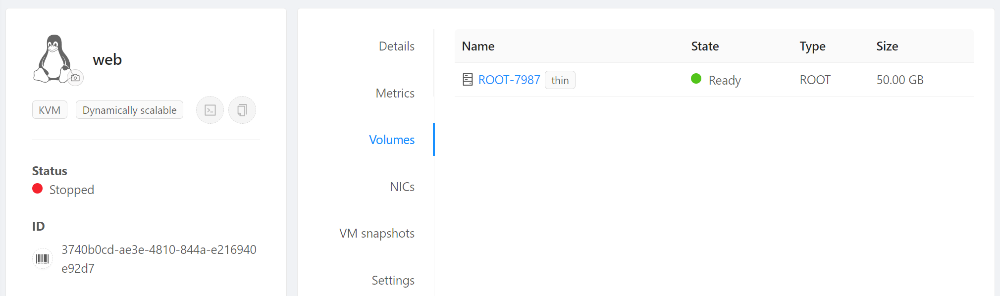

# Templates

Neste passo demonstraremos:

- Como criar __templates__, análogos às _imagens_ das nuvens públicas
- Usando __userdata__ para customizar instâncias a partir de templates

Utilizaremos os recursos criados no passo anterior, [DR e Snapshots](snapshots.md). Execute-o se ainda não o fez.

## Instalação da aplicação

!!! info
    O exemplo que segue é ilustrativo e a aplicação é muito simples. Mas a lógica serve para aplicações de qualquer natureza e complexidade, sejam monolitos, microsserviços, _back-ends_ etc.

Usando o _port forwarding_ configurado anteriormente entre via SSH no servidor _web_:

```bash
ssh root@xIP_FWDx -p 22000
```

E instale o PHP para Apache:
```bash
apt install php libapache2-mod-php php-mysql
```

Para testar,
```bash
cat << 'EOF' > /var/www/html/info.php
<?php
phpinfo();
?>
EOF
```

E acesse:
```
http://xIP_WEBx/info.php
```
(aqui usamos o IP mapeado via _Static NAT_ para a instância _web_).

Agora criaremos nossa aplicação, que lista a tabela `todo_list`:

```bash
nano /var/www/html/todo.php
```

Copie o conteúdo, substituindo o endereço IP pelo do servidor _bd_, que pode ser lido no painel do CloudStack, e pela senha que utilizou para o banco:

```php
<?php
$user = "example_user";
$password = "xSENHA_BDx";
$database = "example_database";
$table = "todo_list";
$host = "xIP_BDx"; // Coloque o IP privado do servidor bd no CloudStack

try {
  $db = new PDO("mysql:host=$host;dbname=$database", $user, $password);
  echo "<h2>TODO</h2><ol>"; 
  foreach($db->query("SELECT content FROM $table") as $row) {
    echo "<li>" . $row['content'] . "</li>";
  }
  echo "</ol>";
} catch (PDOException $e) {
    print "Error!: " . $e->getMessage() . "<br/>";
    die();
}
?>
```

!!! tip "Dica"
    Note que usamos o IP privado do bd, pois o servidor web o acessa pela rede privada. Com isso, não precisamos expor o bd para a rede pública.

E acesse:
```
http://xIP_WEBx/todo.php
```
(use o IP mapeado via _Static NAT_ para a instância _web_).

### Página com CPU alta

Como preparação para testar o autoscaling mais adiante, criaremos uma página com a única finalidade de provocar alto consumo de CPU.

Na sessão SSH da instância _web_ execute:

```bash
nano /var/www/html/cpu.php
```
E adicione o conteúdo:
```php
<?php
$startTime = microtime(true);

for ($i = 0; $i < 1000000; $i++) {
    $hash = sha1(mt_rand());
}

$endTime = microtime(true);

$duration = $endTime - $startTime;
echo "Duration: " . number_format($duration, 4) . " seconds<br>";

echo "Current Time: " . date('H:i:s');
?>
```

Teste a página fazendo refresh no endereço abaixo algumas vezes e vendo o resultado mudar:
```
http://xIP_WEBx/cpu.php
```

## Criação do template

Agora criaremos um _template_ a partir do qual novas instâncias podem ser criadas dinamicamente.

1. Para limpar vestígios de carregamento do _cloud-init_:
```bash
cloud-init clean --logs
```

1. Pare a instância _web_ (__Stop instance__).

2. No menu de navegação à esquerda clique em __Compute__, __Instances__, clique na instância _web_ e em __Volumes__. Clique no link do volume (_ROOT-XXXX_)

1. No canto superior direito, selecione __Create template from volume__

1. Preencha da seguinte forma e dê OK:


## Recriação da instância

Agora criaremos uma nova instância a partir do template:

1. No menu de navegação à esquerda clique em __Compute__, __Instances__
2. Clique no botão __Add instance +__
3. Em __Templates__, escolha __My templates__ e escolha __To Do app__ 

4. Em __Compute offering__ escolha __micro__ (criar offers com CPU/memória fixas)
5. Em __Data disk__ mantenha __No thanks__
6. Em __Networks__ escolha a rede que criou, _minha-rede_
7. Em __SSH key pairs__ escolha a chave criada no passo anterior, por exemplo, _minha-chave_

8.  Em __name__ coloque _teste-template_ e clique __Launch instance__
9.  Em __Compute__, __Instances__ verifique que a instância recém criada a partir do template está ligada e a anterior desligada

10.  No menu à esquerda acesse __Networks__, __Guest networks__, _minha-rede_, __Public IP addresses__ e clique no endereço IP que fora mapeado via _Static NAT_ para o servidor _web_

11.  Clique sobre o IP. Vamos desvincula-lo da instância _web_:

12.  E agora vincule o mesmo IP à nova instância _teste-template_ seguindo o mesmo procedimento clicando em _Enable Static NAT_ e escolhendo-a como destino.
13.  Note que é necessário recriar as regras de firewall para o IP após ter sido remapeado para nova instância:


Usando o endereço IP recém remapeado, acesse-o no browser em:
```
http://xIP_WEBx
```
Deve aparecer a página padrão do Apache.

Acesse também as páginas, substituindo pelo endereço IP recém adquirido:

```
http://xIP_WEBx/info.php
```
```
http://xIP_WEBx/todo.php
```
```
http://xIP_WEBx/cpu.php
```

Se seguiu os passos até aqui, tudo deve funcionar, demonstrando que o servidor criado a partir do template possui toda a programação inserida previamente.

!!! tip "Lembrete"
    Certifique-se de ter remapeado via _Static NAT_ o endereço IP designado para a nova instância _teste-template_, criada a partir do template. Certifique-se de que a instância anterior _web_ esteja desligada para ter certeza de que está acessando a nova instância criada a partir do template.