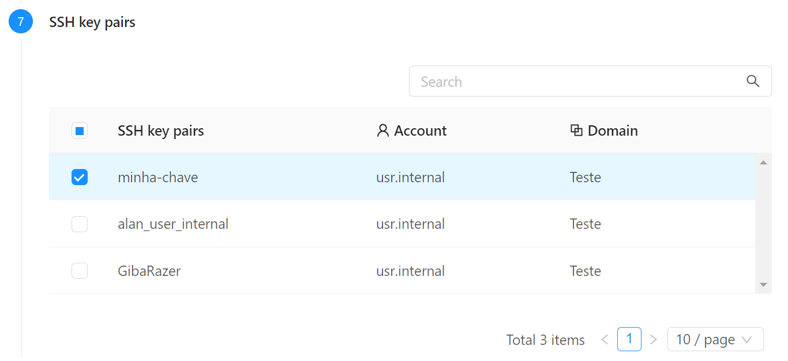
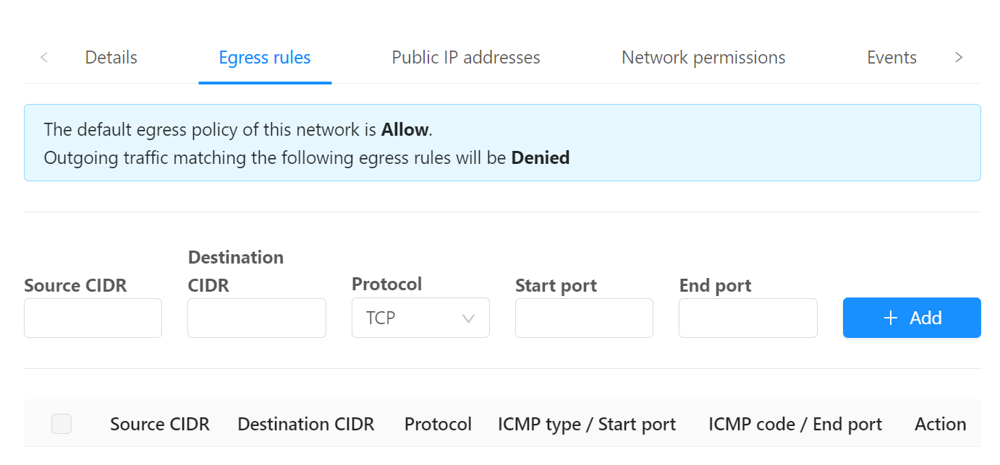
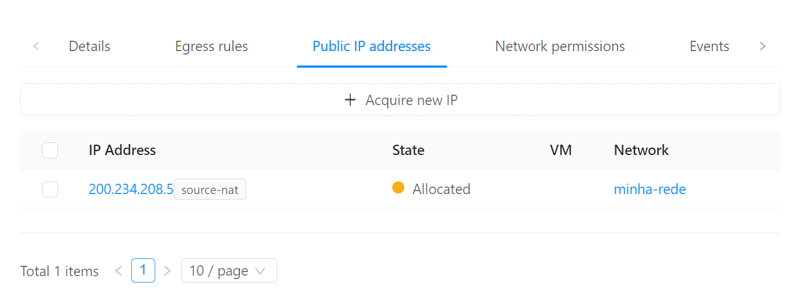
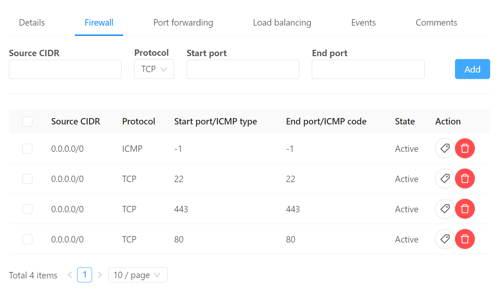

# Compute e Networking

## Login

Para começar, acesse [o painel do CloudStack](https://acs.cloud.locaweb.com.br) e forneça as credenciais que recebeu.

Use a aba "Single Sign-On" se estiver acessando via SAML.

## Chaves SSH

Para poder logar-se nas instâncias, crie um chave SSH e cadastre-a no painel.

1. No menu de navegação à esquerda clique em __Compute__, __SSH key pairs__
2. Clique no botão __Create a SSH Key Pair +__
3. Verifique se possui a chave criada na sua estação:
```bash
cat ~/.ssh/id_rsa.pub
```
Caso ainda não possua, para criá-la:
```bash
ssh-keygen
cat ~/.ssh/id_rsa.pub
```

Copie todas as linhas de saída do comando _cat_ e cole no campo __Public key__. Escolhe um nome como _minha-chave_ e clique OK.


## Rede

Usualmente como em clouds públicas, as instâncias são instaladas em redes com endereços IP privados (exemplo `10.x.x.x`) e acessadas via _port forwarding_ ou _load balancing_.

A rede que você criará ficará totalmente isolada de todas as demais redes de outros clientes, sendo possível a comunicação somente através da saída por IPs públicos e desde que permitida por regras de firewall.

Para criar a rede:

1. No menu de navegação à esquerda clique em __Network__, __Guest networks__
2. Clique no botão __Add network +__
3. Em __name__ coloque um nome como _minha-rede_
4. Em __Network offering__ escolha _TBD_ (criar offer 1000 Mpbs)
5. Os demais campos podem ficar em branco. Clique OK.

## Criando a instância

1. No menu de navegação à esquerda clique em __Compute__, __Instances__
2. Clique no botão __Add instance +__
3. Em __Account__ coloque a sua conta.
4. Em __Templates__, escolha __Community__, digite _ubuntu_ na busca e escolha __Ubuntu-Server-22-Locaweb-VPS__ 

5. Em __Compute offering__ escolha __TBD__ (criar offers com CPU/memória fixas)
6. Em __Data disk__ mantenha __No thanks__
7. Em __Networks__ escolha a rede que criou, _minha-rede_
8. Em __SSH key pairs__ escolha a chave criada no passo anterior, por exemplo, _minha-chave_

9. Coloque o nome _web_ e clique __Launch instance__


## Conectando à internet

Para que a instância criada possa se comunicar com o mundo externo, os próximos passos são:

- Criar regras de _firewall_ restringindo a conexão a origens específicas
- Associar um endereço IP público e porta via _port forwarding_ ou _load balancing_

### Firewall

1. No menu de navegação à esquerda clique em __Network__, __Guest networks__ e clique na rede criada, ex. _minha-rede_
2. Ao clicar na aba __Egress rules__ pode-se verificar que o tráfego de saída para a internet é, por padrão, liberado. É possível limitar com restrições mas, no nosso caso, vamos manter assim.

3. Na aba __Public IP addresses__ vemos que já há um primeiro IP associado e marcado como _source-nat_. Isto indica que tráfego originado de dentro da rede para a internet terá este IP como origem.

4. Este mesmo IP pode ser usado também para filtrar e direcionar tráfego oruindo da internet. Clique sobre ele.
5. Iremos para outra página com detalhes sobre o IP escolhido. Clique na aba __Firewall__ e crie 3 regras de firewall:
    1. __Source CIDR__: _0.0.0.0/0_; __Start port__: _80_; __End port__: _80_ (para aceitar conexões HTTP)
    2. __Source CIDR__: _0.0.0.0/0_; __Start port__: _443_; __End port__: _443_ (para aceitar conexões HTTPS)
    3. __Source CIDR__: _0.0.0.0/0_; __Start port__: _22000_; __End port__: _22099_ (para aceitar conexões SSH num range de portas).

!!! info
    Poderíamos restringir origens para cada uma dessas portas. Por exemplo, poderíamos permitir origens SSH somente para uma origem específica, como um _jump server_.


### Port forwarding

Uma vez configurado qual tráfego permitir, falta direcioná-lo ao destino desejado. Clique sobre a aba __Port forwarding__ e adicione as entradas:

1. __Private port__: _22-22_; __Public port__: _22000-22000_; __Protocol__: _TCP_; botão __Add...__: _web_
Veja como a entrada acima direciona tráfego recebido na porta _pública_ 22000 para a porta _privada_ 22 na VM.
1. __Private port__: _80-80_; __Public port__: _80-80_; __Protocol__: _TCP_; botão __Add...__: _web_
1. __Private port__: _443-443_; __Public port__: _443-443_; __Protocol__: _TCP_; botão __Add...__: _web_


## Conexão

Na estação onde tiver a chave privada associada à chave pública que cadastramos:

```bash
ssh root@<IP público> -p 22000
```

!!! info
    Temos que conectar à porta criada para receber conexões via internet, e esta direciona o tráfego para a porta escolhida (22) na VM.

Caso tenha criado uma chave diferente do _default_ `~/.ssh/id_rsa` seguir o exemplo:

```bash
ssh root@<IP público> -i ~/.ssh/id_rsa2 -p 22000
```
Alguns comandos interessantes:

```bash
apt update
apt install cpuinfo
cpu-info
df -h
```
### Apache

```bash
apt install apache2
```
Acesse o IP no browser para testar:

