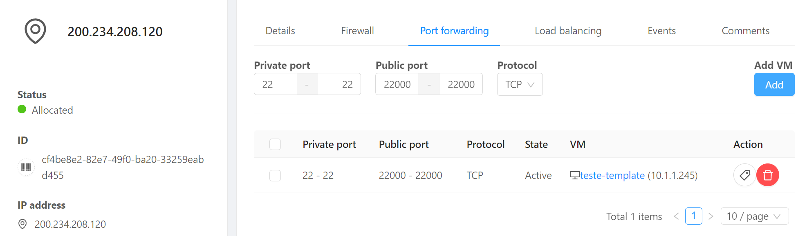

# Load Balancing e Autoscaling

Neste tutorial demonstraremos:

- __Load balancers__ para dividir tráfeto entre múltiplas instâncias
- __Autoscaling__ para adequar o número de instâncias a uma demanda variável

Utilizaremos os recursos criados nos tutoriais anteriores, [Compute e Networking](compute.md) e [Templates e Userdata](templates.md). Execute-os se ainda não o fez.

## Página de teste

Para verificarmos o mecanimso de autoscaling acrescentaremos uma página de alto consumo de CPU.

Acesse a rede pré-criada (_minha-rede_), clique sobre o IP alocado para a instância _teste-template_, acesse a aba __Firewall__ e libere o range de entrada _22000_ até _22099_ para que possamos criar encaminhamentos de acesso SSH.

Acesse a aba __Port forwarding__ e adicione a entrada:

__Private port__: _22-22_; __Public port__: _22000-22000_; __Protocol__: _TCP_; botão __Add...__: _teste-template_

Acesse a instância via SSH:

```bash
ssh root@<Endereço IP> -p 22000
```

Criaremos uma página com alto consumo de CPU. Não se preocupe com o conteúdo. A página faz operações que requerem bastante processamento, para testes de carga.

!!! tip "Curiosidade"
    Eu pedi para o ChatGPT escrever uma página em PHP que consome muita CPU e gera resultados aleatórios. A página é um método estatístico para calcular o valor de Pi

```bash
cat << 'EOF' > /var/www/html/pi.php
<?php
// Define the number of random points to be generated
$numPoints = mt_rand(1e6, 1e7);

$insideCircle = 0;

// Generate random points and check if they are inside the unit circle
for ($i = 0; $i < $numPoints; $i++) {
    $x = mt_rand(0, mt_getrandmax() - 1) / mt_getrandmax();
    $y = mt_rand(0, mt_getrandmax() - 1) / mt_getrandmax();

    if (sqrt($x * $x + $y * $y) <= 1) {
        $insideCircle++;
    }
}

// Estimate the value of Pi using the Monte Carlo method
$piEstimation = (4 * $insideCircle) / $numPoints;

echo "Estimated value of Pi: $piEstimation";
?>
EOF
```

Teste a página fazendo refresh algumas vezes e vendo o resultado mudar.


## Depois

Agora, __apague__ o encaminhamento criado para a porta 80, pois será substituido por _load balancing_.



