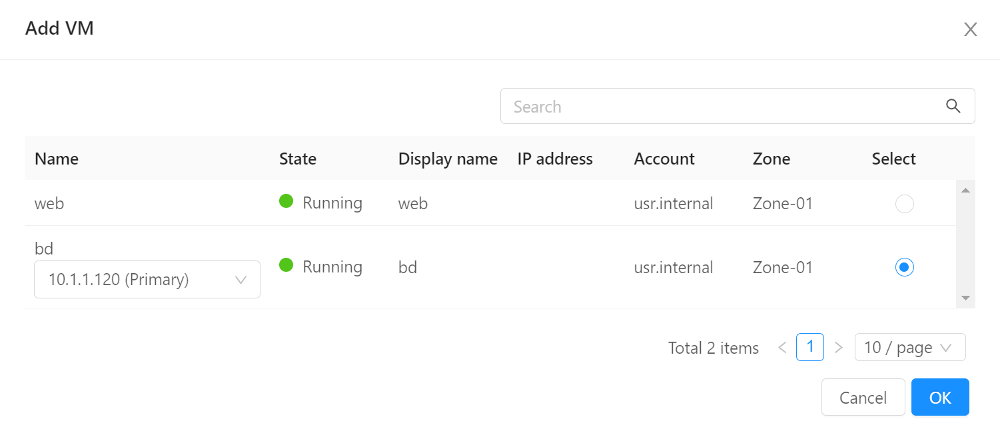
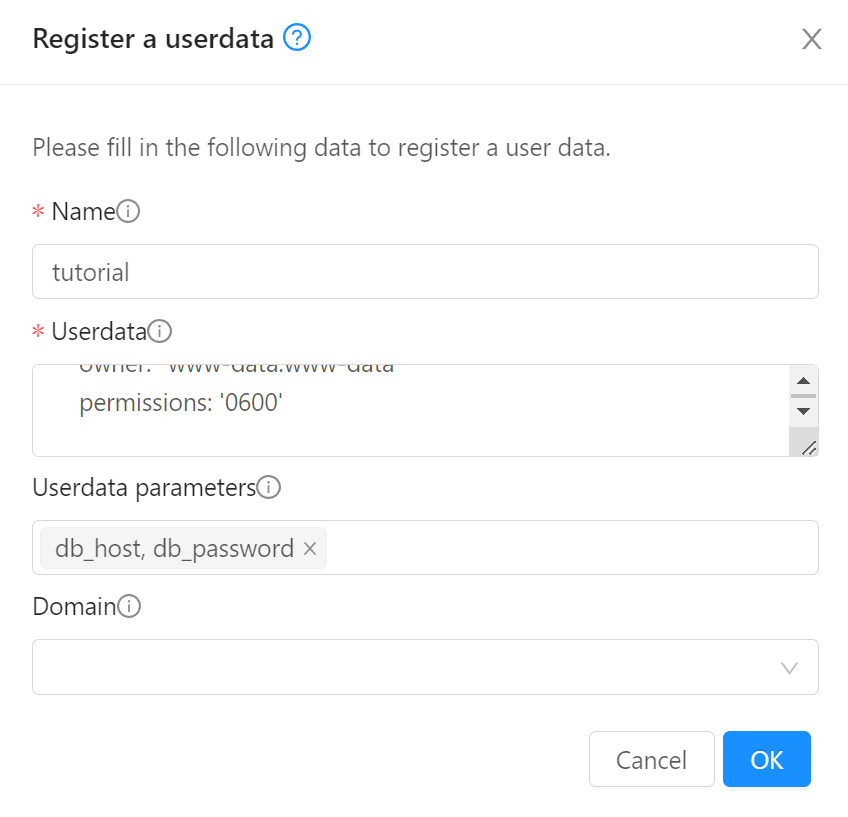
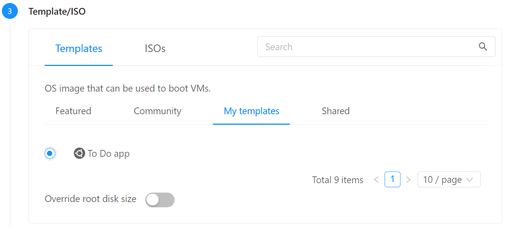
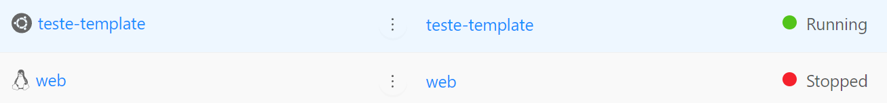

# Templates e Userdata

Neste tutorial demonstraremos:

- Como criar __templates__, análogos às _imagens_ das nuvens públicas
- Usando __userdata__ para customizar instâncias a partir de templates

Utilizaremos os recursos criados no tutorial anterior, [Compute e Networking](compute.md). Execute-o se ainda não o fez.

## Banco de dados

Para suportar a aplicação que criaremos a seguir, precisamos de um banco de dados, que criaremos conforme segue:

### Criação da instância

1. No menu de navegação à esquerda clique em __Compute__, __Instances__
2. Clique no botão __Add instance +__
3. Em __Account__ coloque a sua conta.
4. Em __Templates__, escolha __Community__, digite _ubuntu_ na busca e escolha __Ubuntu-Server-22-Locaweb-VPS__ 

5. Em __Compute offering__ escolha __TBD__ (criar offers com CPU/memória fixas)
6. Em __Data disk__ mantenha __No thanks__
7. Em __Networks__ escolha a rede que criou, _minha-rede_
8. Em __SSH key pairs__ escolha a chave criada no passo anterior, por exemplo, _minha-chave_

9. Coloque o nome _bd_ e clique __Launch instance__

### Port forwarding

Assim como para a primeira instância, precisamos também criar um encaminhamento de porta para conexão via SSH.

Acesse a rede pré-criada (_minha-rede_), clique sobre o IP existente, acesse a aba __Port forwarding__ e adicione a entrada:

__Private port__: _22-22_; __Public port__: _22001-22001_; __Protocol__: _TCP_; botão __Add...__: _bd_


!!! info
    Note como podemos usar portas externas distintas (_22000_ e _22001_) como mesmo IP público para acessar serviços distintos (_web_ e _bd_) que possuem a mesma porta (22) no _back-end_.

### Instalação do MySQL e banco

Agora acesse o servidor de banco de dados, seguimos o mesmo padrão para a primeira instância, bastando mudar a porta para _22001_:

```bash
ssh root@<IP público> -p 22001
```

Para instalar o MySQL:

```bash
apt update
apt install mysql-server
```

Para permitir conexões da rede, edite o arquivo:
```bash
nano /etc/mysql/mysql.conf.d/mysqld.cnf
```
E altere o `bind-address` de `127.0.0.1` para `0.0.0.0` reiniciando em seguida:
```bash
sudo systemctl restart mysql.service
```

Finalmente, para criar o banco:

```bash
mysql -u root -h localhost
```

No prompt to MySQL copie os comandos:

```
CREATE DATABASE `example_database`;
CREATE USER 'example_user'@'%' IDENTIFIED BY '<senha_bd>';
GRANT ALL PRIVILEGES ON `example_database`.* TO 'example_user'@'%';
FLUSH PRIVILEGES;
CREATE TABLE example_database.todo_list (
	item_id INT AUTO_INCREMENT,
	content VARCHAR(255),
	PRIMARY KEY(item_id)
);
EXIT;
```
!!! info
    Embora estejamos permitindo conexões do _meu_usuario_ de qualquer host, lembre que a rede (_minha-rede_) é isolada. Não havendo portas criadas em _firewall_ nem _forwarding_, o servidor de banco permanece fechado a conexões da internet pública. A configuração acima permite acesso por qualquer servidor, desde que dentro da mesma rede.

    Note, também, que o usuário _root_, por default, só permite conexões do próprio servidor (_localhost_)

Agora criaremos uma tabela e preencheremos com dados para uso pela aplicação.

```bash
echo "INSERT INTO example_database.todo_list (content) VALUES" > insert_data.sql

for i in {1..9999}
do
  echo "(CONCAT('Random Task ', ROUND(RAND() * 10000))),"
done >> insert_data.sql

echo "(CONCAT('Random Task ', ROUND(RAND() * 10000)));" >> insert_data.sql

mysql -u root -h localhost < insert_data.sql
```

## Instalação da aplicação

!!! info
    O exemplo que segue é ilustrativo e a aplicação é muito simples. Mas a lógica serve para aplicações de qualquer natureza e complexidade, sejam monolitos, microsserviços, _back-ends_ etc.

Entre novamente no servidor _web_:

```bash
ssh root@<IP público> -p 22000
```

E instale o PHP para Apache:
```bash
apt install php libapache2-mod-php php-mysql
```

Para testar,
```bash
cat << 'EOF' > /var/www/html/info.php
<?php
phpinfo();
?>
EOF
```

E acesse `http://<Endereço IP>/info.php`

Agora criaremos nossa aplicação, que lista a tabela `todo_list`:

```bash
nano /var/www/html/todo.php
```

Copie o conteúdo, substituindo o endereço IP pelo do servidor _bd_, que pode ser lido no painel do CloudStack, e pela senha que utilizou para o banco:

```php
<?php
$user = "example_user";
$password = "<senha_bd>";
$database = "example_database";
$table = "todo_list";
$host = "10.1.1.120";

try {
  $db = new PDO("mysql:host=$host;dbname=$database", $user, $password);
  echo "<h2>TODO</h2><ol>"; 
  foreach($db->query("SELECT content FROM $table") as $row) {
    echo "<li>" . $row['content'] . "</li>";
  }
  echo "</ol>";
} catch (PDOException $e) {
    print "Error!: " . $e->getMessage() . "<br/>";
    die();
}
?>
```

E acesse `http://<Endereço IP>/todo.php`

### Página com CPU alta

Para testar o autoscaling mais adiante, criaremos uma página com alto consumo de CPU. Não se preocupe com o conteúdo.

!!! tip "Curiosidade"
    Eu pedi para o ChatGPT escrever uma página em PHP que consome muita CPU e gera resultados aleatórios. A página é um método estatístico para calcular o valor de Pi

```bash
cat << 'EOF' > /var/www/html/pi.php
<?php
// Define the number of random points to be generated
$numPoints = mt_rand(1e6, 1e7);

$insideCircle = 0;

// Generate random points and check if they are inside the unit circle
for ($i = 0; $i < $numPoints; $i++) {
    $x = mt_rand(0, mt_getrandmax() - 1) / mt_getrandmax();
    $y = mt_rand(0, mt_getrandmax() - 1) / mt_getrandmax();

    if (sqrt($x * $x + $y * $y) <= 1) {
        $insideCircle++;
    }
}

// Estimate the value of Pi using the Monte Carlo method
$piEstimation = (4 * $insideCircle) / $numPoints;

echo "Estimated value of Pi: $piEstimation";
?>
EOF
```

Teste a página fazendo refresh no endereço `http://<Endereço IP>/pi.php` algumas vezes e vendo o resultado mudar.

## Userdata

No código acima, o endereço do _host_ do banco de dados e a senha estão hardcoded, impedindo que o servidor sirva de _template_ para deployment em outros ambientes ou que seja replicado para _load balancing_.

Então:

1. Edite o arquivo `/var/www/html/todo.php` para:
```php
<?php
include '/var/www/config.php'; // Linha acrescentada

$user = "example_user";
$password = DB_PASSWORD; // Valor hardcoded substituído por uma variável
$database = "example_database";
$table = "todo_list";
$host = DB_HOST; // Valor hardcoded substituído por uma variável

try {
  $db = new PDO("mysql:host=$host;dbname=$database", $user, $password);
  echo "<h2>TODO</h2><ol>"; 
  foreach($db->query("SELECT content FROM $table") as $row) {
    echo "<li>" . $row['content'] . "</li>";
  }
  echo "</ol>";
} catch (PDOException $e) {
    print "Error!: " . $e->getMessage() . "<br/>";
    die();
}
?>
```

2. Crie um novo arquivo fora da raiz do site:
```bash
nano /var/www/config.php
```
Insira o conteúdo (use o IP e senha do seu banco de dados):
```php
<?php
define('DB_HOST', '10.1.1.120');
define('DB_PASSWORD', '<senha_bd>');
?>
```
E proteja as permissões:
```bash
chown www-data:www-data /var/www/config.php
chmod 600 /var/www/config.php
```
Acesse novamente `http://<Endereço IP>/todo.php` para testar.

3. Finalmente, apague o arquivo criado:
```bash
rm /var/www/config.php
cloud-init clean
```
Note que a aplicação quebrou. O segundo comando instrui o servidor a carregar o _Userdata_ no próximo boot.

4. No menu de navegação à esquerda clique em __Compute__, __Instances__ e clique na instância _web_
5. Clique no botão __Stop instance__ e confirme.

6. Clique no botão __Edit instance__

7. No campo __Userdata__, cole:
```yaml
#cloud-config

write_files:
  - path: /var/www/config.php
    content: |
      <?php
      // Escrito por Userdata
      define('DB_HOST', '10.1.1.120');
      define('DB_PASSWORD', '<senha_bd>');
      ?>
    owner: "www-data:www-data"
    permissions: '0600'
```

8. Reinicie o servidor. Após aguardar alguns instantes:
    - Reinicie a sessão SSH e verifique que o arquivo `var/www/config.php` tem o conteúdo conforme acima
    - __Verifique que a página funciona normalmente__

!!! question "O que fizemos até agora?"
    Recapitulando:

    - Separamos as configurações num arquivo `config.php` à parte, fora da raiz do site
    - Usamos o mecanismo de _cloud-init_ para carregar as configurações a partir de uma definição na instância.
    - __O que falta__: agora transformaremos a instância num __template__ sem configurações. Este template poderá ser carregado com diferentes campos de _Userdata_ refletindo diferentes configurações, exemplo, _dev_, _staging_, _production_  

## Criação do template

1. Não queremos configurações no template, portanto execute:
```bash
rm /var/www/config.php
cloud-init clean --logs
```
O segundo comando limpa vestígios de carregamentos anteriores do _cloud-init_.

2. Desligue a instância.

3. No menu de navegação à esquerda clique em __Compute__, __Instances__, clique na instância _web_ e em __Volumes__. Clique no link do volume (_ROOT-XXXX_)

4. No canto superior direito, selecione __Create template from volume__

5. Preencha da seguinte forma e dê OK:


## Userdata com variáveis

No próximo passo, criaremos um __Userdata__ parametrizável, ou seja, onde o usuário pode escolher os valores `DB_HOST` e `DB_PASSWORD`

1. No menu de navegação à esquerda clique em __Compute__, __User Data__, __Register a userdata +__
2. No nome, colocar _tutorial_. Em __Userdata__ colar o código abaixo:
```yaml
## template: jinja
#cloud-config

write_files:
  - path: /var/www/config.php
    content: |
      <?php
      define('DB_HOST', '{{ ds.meta_data.db_host }}');
      define('DB_PASSWORD', '{{ ds.meta_data.db_password }}');
    owner: "www-data:www-data"
    permissions: '0600'
```

3. Antes de dar OK preencha o campo __Userdata parameters__ com `db_host, db_password`

!!! info
    Na primeira linha `## template: jinja` configuramos o _cloud-init_ para processar os valores que o CloudStack passa dentro das chaves `{{ }}`. Isto permite a parametrização do _Userdata_.

## Recriação da instância

Agora criaremos uma nova instância a partir do template:

1. No menu de navegação à esquerda clique em __Compute__, __Instances__
2. Clique no botão __Add instance +__
3. Em __Account__ coloque a sua conta.
4. Em __Templates__, escolha __My templates__ e escolha __To Do app__ 

5. Em __Compute offering__ escolha __TBD__ (criar offers com CPU/memória fixas)
6. Em __Data disk__ mantenha __No thanks__
7. Em __Networks__ escolha a rede que criou, _minha-rede_
8. Em __SSH key pairs__ escolha a chave criada no passo anterior, por exemplo, _minha-chave_

9. Em __Advanced mode__, habilite __Show advanced settings__
10. Em __Stored Userdata__, selecione __tutorial__ e preencha __db_host__: `<IP do servidor de BD>`; __db_password__: `<senha_bd>`

11. Em __name__ coloque _teste-template_ e clique __Launch instance__
12. Em __Compute__, __Instances__ verifique que a instância recém criada a partir do template está ligada e a anterior desligada

13. No menu à esquerda acesse __Networks__, __Guest networks__, _minha-rede_, __Public IP addresses__ e clique __+ Acquire new IP__. Escolha qualquer IP livre.

14. Clique sobre o IP. Libere o tráfego de origem _0.0.0.0/0_ para _TCP_ e portas _80:80_

15. Em __Port forwarding__ encaminhe a porta 80 para a VM _teste-template_


Acesse o novo IP no browser em `http://<Endereço IP>`. Deve aparecer a página padrão do Apache.

Acesse também as páginas:

```
http://<Endereço IP>/info.php
http://<Endereço IP>/todo.php
http://<Endereço IP>/pi.php
```

Se seguiu os passos até aqui, tudo deve funcionar, demonstrando que o servidor criado a partir do template possui toda a programação inserida previamente.

!!! tip "Lembrete"
    Lembre-se de usar o novo endereço IP designado para a nova instância, criada a partir do template. Certifique-se de que a instância anterior _web_ esteja desligada para ter certeza de que está acessando a nova instância criada a partir do template.