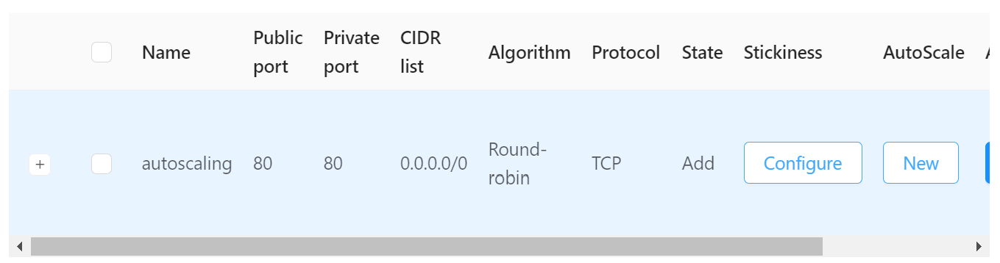
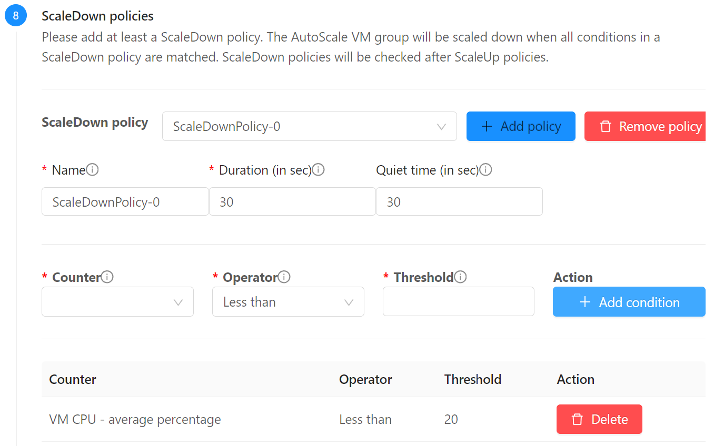

# Load Balancing e Autoscaling

Neste passo demonstraremos:

- __Load balancers__ para dividir tráfeto entre múltiplas instâncias
- __Autoscaling__ para adequar o número de instâncias a uma demanda variável

Utilizaremos os recursos criados nos tutoriais anteriores. Execute-os se ainda não o fez.

Para começar, desligaremos a instância _teste-template_ criada no passo anterior.

No menu de navegação à esquerda clique em __Compute__, __Instances__ e clique na instância _teste-template_, e clique no botão __Stop instance__.

## Criação do Load Balancer

1. No menu à esquerda selecione __Network__, __Guest networks__ e clique na rede _minha-rede_
2. Clique sobre o IP que alocamos via _Static NAT_ para _teste_template_, por exemplo `200.234.208.120`
3. Clique em __Disable static NAT__ para liberar o IP.
4. Clique na aba __Load balancing__ e preencha conforme:
    * __Name__: _lb_
    * __Public port__: _80_
    * __Private port__: _80_
    * __CIDR list__: _0.0.0.0/0_
    * __Algorithm__: _Round-robin_
    * __Protocol__: _TCP_
    * __Autoscale__: _Yes_
    * E clique no botão __Add__

5. Clique no botão __New__ sob __AutoScale__


## Criação do AutoScale Group

1. Aceite a zona, e escolha o template _To Do app_

2. Em __Compute offering__ escolha __TBD__
3. Escolha a rede _minha-rede_

4. Em __Load balancing__ mantenha a seleção da regra _lb_ 

5. Em __ScaleUp policies__, ajuste o __Duration__ e __Quite time__ para 30 segundos, para encurtar o tempo de resposta no nosso teste de carga. Em __Counter__ escolha _VM CPU - average percentage_, __Operator__: _Greater than_, __Threshold__: _70_ e pressione __Add condition__

5. Em __ScaleDown policies__, ajuste o __Duration__ e __Quite time__ para 30 segundos, para encurtar o tempo de resposta no nosso teste de carga. Em __Counter__ escolhe _VM CPU - average percentage_, __Operator__: _Less than_, __Threshold__: _20_ e pressione __Add condition__

6. Em __Advanced mode__, habilite __Show advanced settings__. No campo __Userdata__ cole o conteúdo, substuindo o IP interno do servidor _bd_:
```yaml
#cloud-config

write_files:
  - path: /var/www/config.php
    content: |
      <?php
      // Escrito por Userdata
      define('DB_HOST', '10.1.1.120'); // coloque o IP interno do bd
      define('DB_PASSWORD', '<senha_bd>');
      ?>
    owner: "www-data:www-data"
    permissions: '0600'
```

7. Finalmente, nos detalhes, coloque o nome de sua escolha, __Expunge VM grace period__ de 30 segundos, para que as VMs sejam rapidamente apagadas após desativadas; mínimo e máximo de 1 a 4 membros; __Polling interval__ de 30 segundos também. Conclua clicando em __Create__.

!!! Info
    Na versão do CloudStack `4.18.0.0` em que foi feito este tutorial, ainda não havia o recurso de uso de variáveis dinâmicas no _Userdata_ de _Autoscaling groups_. Isto foi [acrescentado](https://docs.cloudstack.apache.org/en/4.18.1.0/adminguide/autoscale_with_virtual_router.html?highlight=autoscale#updating-autoscale-vm-profile) na versão `4.18.1.0`. 

## Teste da aplicação

Você pode verificar o grupo criado no menu __Compute__, __AutoScale VM Groups__. E, também, em __Compute__, __Instances__, pode verificar que já foi criada uma instância com nome do tipo _autoScaleVm-grupo-autoscale-1-apknvq_.

Pode também testar as páginas, usando o endereço IP público associado ao load balancer criado.

```
http://200.234.208.120/info.php
http://200.234.208.120/todo.php
http://200.234.208.120/pi.php
```

## Teste de carga

Instale o gerador de carga "hey" com `sudo apt install hey` ou `brew install hey` e digite, substituindo pelo IP alocado:

```bash
hey -z 3m http://200.234.208.120/pi.php
```

### Acompanhamento do AutoScale

Durante o andamento do teste acompanhe o comportamento do AutoScale em __Compute__, __AutoScaleVM Groups__ e clicando em __Refresh__ à medida em que o teste ocorre. 


Também é interessante acompanhar em __Compute__, __Instances__ como as VMs vão sendo paradas e apagadas depois que o teste termina.


E, também, ao clicar sobre a instância, é possível ver o comportamento em __Metrics__:


Além disso, após o final do teste verifique como a quantidade de VMs disponíveis vai baixando automaticamente.

