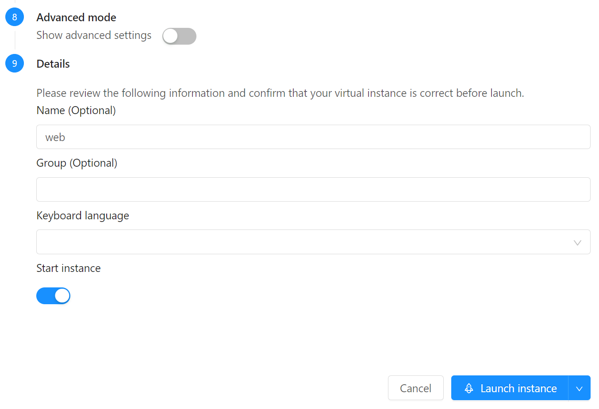
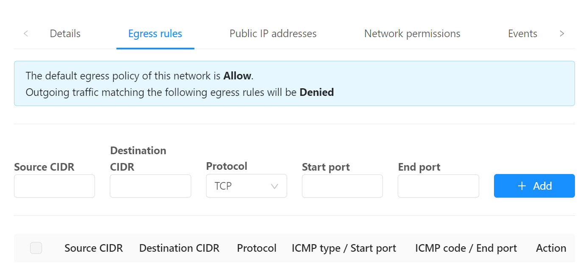
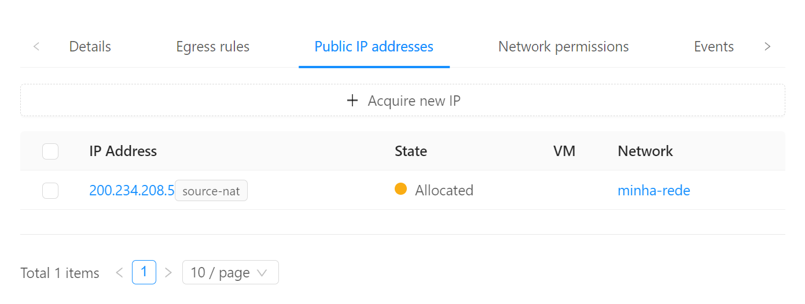
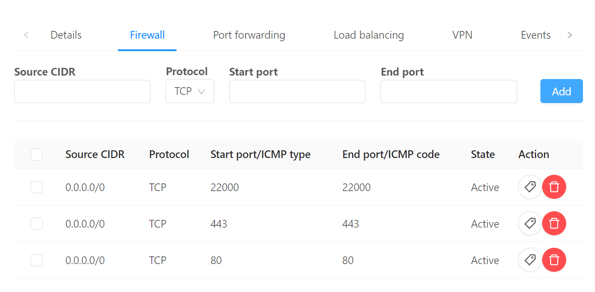
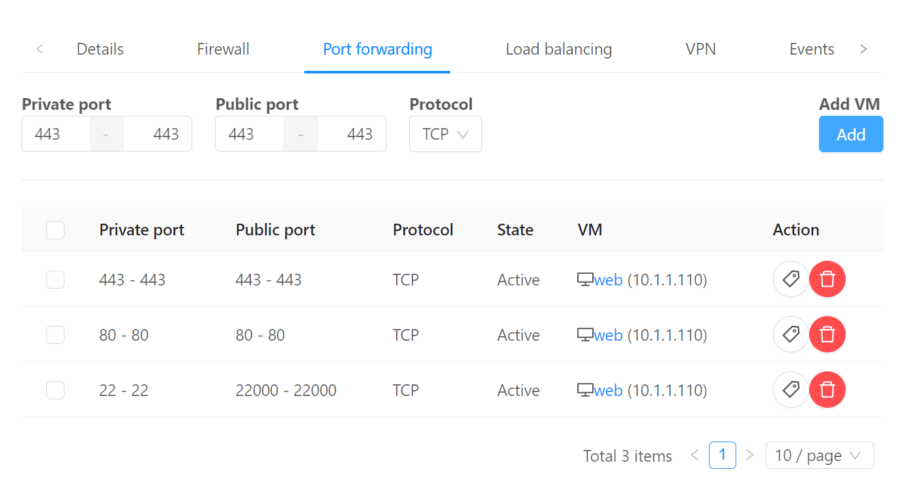
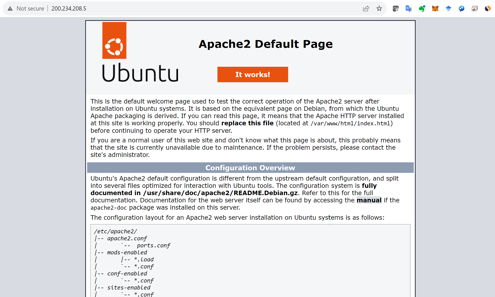

# Primeira instância

## Login

Para começar, acesse [o painel do CloudStack](https://acs.cloud.locaweb.com.br) e forneça as credenciais que recebeu.

Use a aba "Single Sign-On" se estiver acessando via CAS.

## Chaves SSH

Para poder logar-se nas instâncias, crie um chave SSH e cadastre-a no painel.

1. No menu de navegação à esquerda clique em __Compute__, __SSH key pairs__
2. Clique no botão __Create a SSH Key Pair +__
3. Verifique se possui a chave criada na sua estação:
``` bash
cat ~/.ssh/id_rsa.pub
```
Caso ainda não possua, para criá-la:
``` bash
ssh-keygen
cat ~/.ssh/id_rsa.pub
```

Copie todas as linhas de saída do comando _cat_ e cole no campo __Public key__. Escolhe um nome como _minha-chave_ e clique OK.


## Rede

Usualmente como em clouds públicas, as instâncias são instaladas em redes com endereços IP privados (exemplo `10.x.x.x`) e acessadas via _port forwarding_ ou _load balancing_.

A rede que você criará ficará totalmente isolada de todas as demais redes de outros clientes, sendo possível a comunicação somente através da saída por IPs públicos e desde que permitida por regras de firewall.

Para criar a rede:

1. No menu de navegação à esquerda clique em __Network__, __Guest networks__
2. Clique no botão __Add network +__
3. Em __name__ coloque um nome como _minha-rede_
4. Em __Network offering__ escolha _TBD_ (criar offer 1000 Mpbs)
5. Os demais campos podem ficar em branco. Clique OK.

## Criando a instância

1. No menu de navegação à esquerda clique em __Compute__, __Instances__
2. Clique no botão __Add instances__
3. Em __Account__ coloque a sua conta.
4. Em __Templates__, escolha __Community__, digite _ubuntu_ na busca e escolha __Ubuntu-Server-22-Locaweb-VPS__ 

5. Em __Compute offering__ escolha __TBD__ (criar offers com CPU/memória fixas)
6. Em __Data disk__ mantenha __No thanks__
7. Em __SSH key pairs__ escolha a chave criada no passo anterior, por exemplo, _minha-chave_

8. Coloque o nome _web_ e clique __Launch instance__


## Firewall

Para que a instância criada possa se comunicar com o mundo externo, os próximos passos são:

- Criar regras de _firewall_ restringindo a conexão a origens específicas
- Associar um endereço IP público e porta via _port forwarding_ ou _load balancing_

Para tal, siga os passos:

1. No menu de navegação à esquerda clique em __Network__, __Guest networks__ e clique na rede criada, ex. _minha-rede_
2. Ao clicar na aba __Egress rules__ pode-se verificar que o tráfego de saída para a internet é, por padrão, liberado. É possível limitar com restrições mas, no nosso caso, vamos manter assim.

3. Na aba __Public IP addresses__ vemos que já há um primeiro IP associado e marcado como _source-nat_. Isto indica que tráfego originado de dentro da rede para a internet terá este IP como origem.

4. Este mesmo IP pode ser usado também para filtrar e direcionar tráfego oruindo da internet. Clique sobre ele.
5. Iremos para outra página com detalhes sobre o IP escolhido. Clique na aba __Firewall__ e crie 3 regras de firewall:
    1. __Source CIDR__: _0.0.0.0/0_; __Start port__: _80_; __End port__: _80_ (para aceitar conexões HTTP)
    2. __Source CIDR__: _0.0.0.0/0_; __Start port__: _443_; __End port__: _443_ (para aceitar conexões HTTPS)
    3. __Source CIDR__: _0.0.0.0/0_; __Start port__: _22000_; __End port__: _22000_ (para aceitar conexões SSH)
    Note que poderíamos restringir origens para cada uma dessas portas. Por exemplo, poderíamos permitir origens SSH somente para uma origem específica, como um _jump server_.


## Port forwarding

Uma vez configurado qual tráfego permitir, falta direcioná-lo ao destino desejado. Clique sobre a aba __Port forwarding__ e adicione as entradas:

1. __Private port__: _22-22_; __Public port__: _22000-22000_; __Protocol__: _TCP_; botão __Add...__: _web_.
Veja como a entrada acima direciona tráfego recebido na porta _pública_ 22000 para a porta _privada_ 22 na VM.
1. __Private port__: _80-80_; __Public port__: _80-80_; __Protocol__: _TCP_; botão __Add...__: _web_
1. __Private port__: _443-443_; __Public port__: _443-443_; __Protocol__: _TCP_; botão __Add...__: _web_


## Conexão

Na estação onde tiver a chave privada associada à chave pública que cadastramos:

``` bash
ssh root@<IP público> -p 22000
```
Note que temos que conectar à porta criada para receber conexões via internet, e que esta direciona o tráfego para a porta escolhida (22) na VM.

Caso tenha criado uma chave diferente do _default_ `~/.ssh/id_rsa` seguir o exemplo:

``` bash
ssh root@<IP público> -i ~/.ssh/id_rsa2 -p 22000
```
Alguns comandos interessantes:

``` bash
apt update
apt install cpuinfo
cpu-info
df -h
```
### Apache

``` bash
apt install apache2
```
Acesse o IP no browser para testar:

