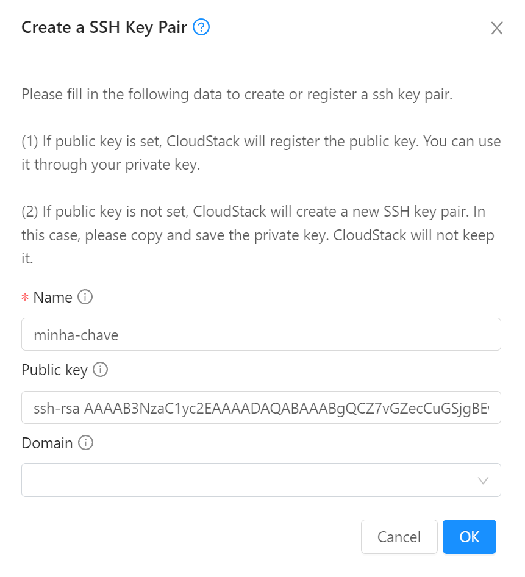

# Primeira instância

## Login

Para começar, acesse [o painel do CloudStack](https://acs.cloud.locaweb.com.br) e forneça as credenciais que recebeu.

Use a aba "Single Sign-On" se estiver acessando via CAS.

## Chaves SSH

Para poder logar-se nas instâncias, crie um chave SSH e cadastre-a no painel.

1. No menu de navegação à esquerda clique em __Compute__, __SSH key pairs__
2. Clique no botão __Create a SSH Key Pair +__
3. Verifique se possui a chave criada na sua estação:
``` bash
cat ~/.ssh/id_rsa.pub
```
Caso ainda não possua, para criá-la:
``` bash
ssh-keygen
cat ~/.ssh/id_rsa.pub
```

Copie todas as linhas de saída do comando _cat_ e cole no campo __Public key__. Escolhe um nome como _minha-chave_ e clique OK.



## Rede

Usualmente como em clouds públicas, as instâncias são instaladas em redes com endereços IP privados (exemplo `10.x.x.x`) e acessadas via _port forwarding_ ou _load balancing_.

A rede que você criará ficará totalmente isolada de todas as demais redes de outros clientes, sendo possível a comunicação somente através da saída por IPs públicos e desde que permitida por regras de firewall.

Para criar a rede:

1. No menu de navegação à esquerda clique em __Network__, __Guest networks__
2. Clique no botão __Add network +__
3. Em __name__ coloque um nome como _minha-rede_
4. Em __Network offering__ escolha _TBD_
5. Os demais campos podem ficar em branco. Clique OK.

