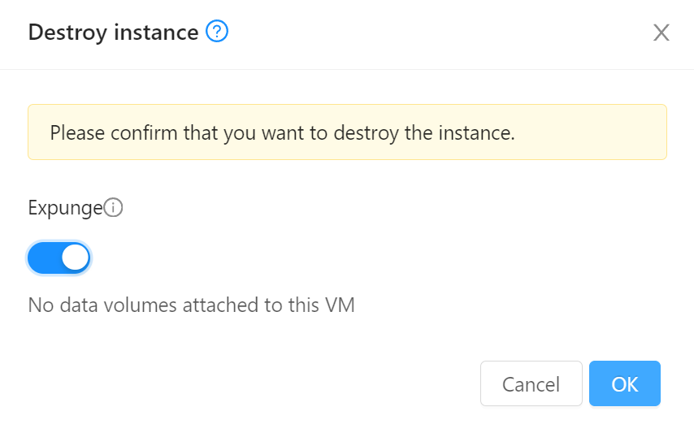
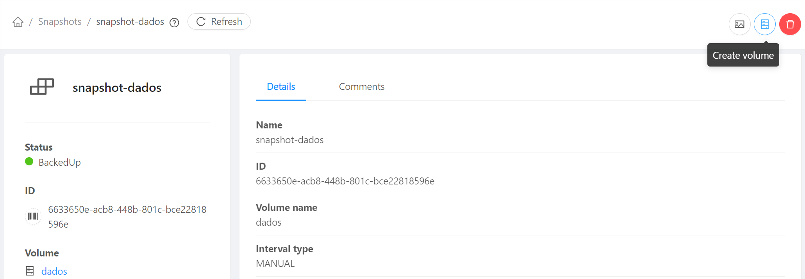

# DR e Snapshots

Neste passo demonstraremos como usar __Snapshots__ e __VM Snapshots__ para diversos cenários de DR.

Usaremos como exemplo um servidor de banco de dados MySQL.

Utilizaremos alguns recursos criados no passo anterior, [Compute e Networking](compute.md). Execute-o se ainda não o fez.

## Banco de dados

Para suportar a aplicação que criaremos a seguir, precisamos de um banco de dados, que criaremos conforme segue:

### Criação da instância

1. No menu de navegação à esquerda clique em __Compute__, __Instances__
2. Clique no botão __Add instance +__
3. Em __Account__ coloque a sua conta.
4. Em __Templates__, escolha __Community__, digite _ubuntu_ na busca e escolha __Ubuntu-Server-22-Locaweb-VPS__ 

5. Em __Compute offering__ escolha __TBD__ (criar offers com CPU/memória fixas)
6. Em __Data disk__ mantenha __No thanks__
7. Em __Networks__ escolha a rede que criou, _minha-rede_
8. Em __SSH key pairs__ escolha a chave criada no passo anterior, por exemplo, _minha-chave_

9. Coloque o nome _bd_ e clique __Launch instance__

### Port forwarding

Ao contrário do _Static NAT_, o método de _Port Forwarding_ permite a reutilização de um mesmo Endereço IP público para diferentes instâncias, em função da porta acessada.

Por exemplo, para acesso SSH podemos encaminhar a porta _22000_ de um IP para a instância _web_, a porta _22001_ do mesmo IP para _bd_ e assim por diante.

Isso proporciona mais um nível de segurança além do _firewall_, porque sem um encaminhamento explícito a instância fica inacessível pela internet pública. É um bom caso de uso para a instância _bd_, para a qual precisamos abrir apenas a porta de SSH para fora da _minha-rede_.

Acesse a rede pré-criada (_minha-rede_) e clique sobre o primeiro IP da lista, que possui a nota `source-nat` ao lado dele.

Clique na aba __Firewall__ e crie a regra:

__Source CIDR__: _0.0.0.0/0_; __Start port__: _22000_; __End port__: _22099_ (para aceitar conexões SSH num range de portas).

Acesse a aba __Port forwarding__ e adicione as entradas:

  1. __Private port__: _22-22_; __Public port__: _22000-22000_; __Protocol__: _TCP_; botão __Add...__: _web_
  1. __Private port__: _22-22_; __Public port__: _22001-22001_; __Protocol__: _TCP_; botão __Add...__: _bd_


!!! info
    Note como podemos usar portas externas distintas (_22000_ e _22001_) como mesmo IP público para acessar serviços distintos (_web_ e _bd_) que possuem a mesma porta (22) no _back-end_.

### Instalação do MySQL e banco

Agora acesse o servidor de banco de dados, lembrando de usar a porta _22001_:

```bash
# Substitua o endereço IP abaixo pelo que foi configurado com port forwarding acima
ssh root@200.234.208.5 -p 22001
```

Para instalar o MySQL:

```bash
apt update
apt install mysql-server
```

Para permitir conexões da rede, edite o arquivo:
```bash
nano /etc/mysql/mysql.conf.d/mysqld.cnf
```
E altere o `bind-address` de `127.0.0.1` para `0.0.0.0` reiniciando em seguida:
```bash
sudo systemctl restart mysql.service
```

Finalmente, para criar o banco:

```bash
mysql -u root -h localhost
```

No prompt to MySQL copie os comandos:

```SQL
CREATE DATABASE `example_database`;
CREATE USER 'example_user'@'%' IDENTIFIED BY '<senha_bd>';
GRANT ALL PRIVILEGES ON `example_database`.* TO 'example_user'@'%';
FLUSH PRIVILEGES;
CREATE TABLE example_database.todo_list (
	item_id INT AUTO_INCREMENT,
	content VARCHAR(255),
	PRIMARY KEY(item_id)
);
```
!!! info
    Embora estejamos permitindo conexões do _meu_usuario_ de qualquer host, lembre que a rede (_minha-rede_) é isolada. Não havendo portas criadas em _firewall_ nem _forwarding_ para o MySQL, o servidor de banco permanece fechado a conexões da internet pública. A configuração acima permite acesso por qualquer servidor, desde que dentro da mesma rede.

    Note, também, que o usuário _root_, por default, só permite conexões do próprio servidor (_localhost_)

Para preparar a VM para o snapshot, saia do prompt to MySQL com `exit;` e encerre o serviço para que escritas pendentes sejam gravadas em disco:

```bash
systemctl stop mysql
```

## Snapshot de volume raiz

A seguir ilustrarmos o uso de _snapshots_ do volume _raiz_ para recuperação da VM.

!!! Warning
    Estamos fazendo _snapshot_ apenas do volume da VM e não do estado da memória. Por isso encerramos o serviço para que dados não sejam perdidos.

1. No menu de navegação à esquerda clique em __Compute__, __Instances__ e selecione _bd_
2. Na seção à direita clique em __Volumes__ e selecione o volume raiz (_ROOT-XXXX_)

3. Ao abrir os detalhes do volume _ROOT-XXXX_ clique em __Take snapshot__ e escolha o nome _snapshot-bd_


4. Confira que o _snapshot_ com o nome escolhido, _snapshot-bd_ foi criado clicando em __Storage__, __Snapshots__ no menu de navegação à esquerda.
5. Agora simularemos um desastre, apagando a VM. Clique em __Compute__, __Instances__, selecione _bd_, clique em __Destroy instance__ e habilite a opção __Expunge__


6. A maneira de recuperar uma VM a partir de um disco raiz é, primeiro, criar um _template_ a partir dele. Clique em __Storage__, __Snapshots__ e selecione o _snapshot-bd_. Clique no botão __Create template__.

7. Coloque nome e descrição _template-bd_, e __OS type__ _Other Ubuntu (64 bit)_ aceitando os demais parâmetros.
8. Verifique que o _template_ foi criado em __Images__, __Templates__

9. Finalmente crie a instância a partir do _template_. Clique em __Compute__, __Instances__, __Add instance +__.
    - Em __Template/ISO__ escolha __My templates__, _template-bd_.
    - Em __Compute offering__ escolha _TBD_
    - Em __Networks__ escolha _minha-rede_ para colocar a instância na mesma rede que a _web_
    - Em __SSH key pairs__ escolha _minha-chave_ cadastrada previamente.
    - Em __Name (Optional)__ coloque _bd_.
10. Em __Network__, __Public IP addresses__, repita os passos descritos acima em [Port forwarding](#port-forwarding) para refazer o redirecionamento. 

Acesse o servidor novamente:

```bash
# Substitua o endereço IP abaixo pelo que foi configurado com port forwarding acima
ssh root@200.234.208.5 -p 22001
```
A conexão pode ser recusada pelo cliente SSH devido à mudança de chave no servidor, o que é esperado já que ele foi recriado. Para apagar a chave antiga do cliente:
```bash
ssh-keygen -R "[200.234.208.5]:22001" # substitua pelo IP acima
```
Após logar-se confira se o banco foi recuperado:
```bash
mysql -u root -h localhost
```

```SQL
SHOW DATABASES; 
USE example_database;
SHOW TABLES;
SELECT * FROM todo_list;
```

!!! Info
    Em resumo: Criamos um snapshot do volume raiz de uma instância, a partir do _snapshot_ um _template_ e, do _template_, uma nova instância:

    Instância :arrow_forward: _snapshot_ :arrow_forward: _template_ :arrow_forward: nova instância

## VM Snapshot

Outro possível cenário de DR é uma operação que precisa ser revertida, sem que a instância tenha sido necessariamente perdida. 

Continue logado no prompt do MySQL e execute:

```SQL
USE example_database;
INSERT INTO todo_list (content) VALUES ("Minha primeira tarefa");
INSERT INTO todo_list (content) VALUES ("Minha segunda tarefa");
```
Adicione mais linhas a gosto. Para testar a inclusão digite:
```SQL
SELECT * FROM todo_list;
```

O estado da instância, incluindo armazenamento e memória, pode ser salvo num _VM Snapshot_, que funciona como uma fotografia. Este difere do _snapshot_ anterior, que grava somente o conteúdo do volume de armazenamento. 

1. Em __Compute__, __Instances__, selecione _bd_ e clique em __Take VM snapshot__ (atenção, não confundir com _Take VM volume snapshot_ ao lado):

2. Escolha o nome e habilite as opções __Snapshot memory__ e __Quiesce VM__:

3. Após a criação do _VM snapshot_ volte ao prompt do MySQL para simular uma operação destrutiva:
```SQL
DELETE FROM todo_list;
SELECT * FROM todo_list;
```
4. Em __Storage__, __VM snapshots__, selecione o _VM snapshot_ criado e clique em __Revert to VM snapshot__:

Reconecte-se ao servidor e execute os queries:
```SQL
USE example_database;
SELECT * FROM todo_list;
```
Para verificar que não somente os dados mas, também, o estado da instância foi restaurado no exato ponto em que foi feito o _VM snapshot_ execute, por exemplo, o comando `uptime` no shell, demonstrando que a instância parece ter uma tempo de vida mais longo do que o decorrido desde a recuperação.

!!! Info
    Em resumo: O _VM snapshot_ permite reverter a instância ao estado em que ele foi produzido

    Instância :arrow_forward: _VM snapshot_ :arrow_forward: instância é alterada :arrow_forward: _Revert to VM snapshot_ :arrow_forward: instância no estado inicial

## Snapshot de volume anexado

Agora demonstraremos um outro cenário de DR onde usamos um volume específico de dados, separado da raiz da instância. No exemplo a seguir, tal volume é usado para armazenar _dumps_ do MySQL que podem ser recuperados anexando um _snapshot_ previamente salvo.

Obs. Antes de iniciar, apague o _VM Snapshot_ criado em __Storage__, __VM snapshots__ pois sua existência é incompatível com as operações a seguir.

1. Acesse __Storage__, __Volumes__ e __Create volume +__, preencha com nome _dados_ e tamanho _50_

2. Clique no volume criado e em __Attach disk__

3. Escolha a instância _bd_ para anexar o volume

4. No shell da instância _bd_ execute:
```bash
lsblk
```
E note que há uma nova partição `vdb`. Formate-a com o comando:
```bash
mkfs.ext4 /dev/vdb
```
Para mapear uma pasta _dados_ para a nova partição:
```bash
mkdir -p /dados
```
Edite o arquivo `/etc/fstab`:
```bash
nano /etc/fstab
```
Adicionando, ao final, a linha:
```
/dev/vdb    /dados    ext4    defaults    0    2
```
Ao final, carregue a nova configuração com:
```bash
mount -a
```
Verifique que a pasta _dados_ está configurada com o comando:
```bash
df -h
```
Cuja saída deverá conter a linha:
```
/dev/vdb         49G   24K   47G   1% /dados
```
5. Verifique que a tabela _example_database.todo_list_ continua populada:
```
mysql -u root
```
```SQL
SELECT * FROM example_database.todo_list;
```

6. Volte ao shell (digitando `EXIT;` no prompt to MySQL) e execute um backup para a pasta _dados_:
```bash
mysqldump -u root example_database todo_list > /dados/dump-todo-list.sql
```
Você pode verificar o conteúdo do _dump_ com:
```bash
cat /dados/dump-todo-list.sql
```
7. De volta ao painel do CloudStack, na página do volume _dados_ clique em __Take snapshot__, e dê o nome _snapshot-dados_:

8. Simularemos agora que houve uma reinstalação do zero, com a tabela vazia e sem a presença da partição contendo o _dump_.
```bash
umount /dados
mysql -u root
```
```SQL
DELETE FROM example_database.todo_list;
```
9. Clique em __Storage__, __Volumes__ e selecione o volume _dados_. Desconecte-o clicando em __Detach disk__.

Em seguida, delete o volume _dados_ clicando em __Destroy volume__ (habilite __Expunge__).
10. Agora damos início à recuperação. Usaremos o _snapshot_ do volume _dados_ salvo. Clique em __Storage__, __Snapshots__, _snapshot-dados_ e selecione __Create volume__. Para diferenciar do anterior, dê ao novo volume o nome _dados-restore_ e tamanho _50_.


11. Finalmente, acesse __Storage__, __Volumes__, _dados-restore_, clique em __Attach disk__ escolhendo a VM _bd_.
12. Para remapear a partição à pasta _dados_:
```bash
mount -a
```
A esta altura você pode verificar que o _dump_ já está acessível:
```bash
ls /dados
```
Para recuperar o _dump_:
```bash
mysql -u root example_database < /dados/dump-todo-list.sql
mysql -u root
```
```SQL
SELECT * FROM example_database.todo_list;
```
Com isso recuperamos o conteúdo da tabela.

!!! Info
    Em resumo: O _snapshot_ de uma partição de dados permite a recuperação destes reconstruindo a partição e reanexando-a à instância para carregamento.

    Instância :arrow_forward: _dump_ :arrow_forward: volume _dados_ :arrow_forward: _snapshot_ do volume _dados_ :arrow_forward: gera volume _dados-restore_ :arrow_forward: _attach disk_ :arrow_forward: instância sem dados :arrow_forward: recuperação via importação

!!! Tip
    A opção de _snapshot_ de volumes pode ser automatizada via agendamentos, como você pode constatar explorando o menu.

## Observações

Vimos 3 formas diferentes de DR:

- Reconstrução de uma VM a partir de _snapshot_ de volume raiz
- Reversão a um estado anterior através de _VM snapshot_. Pode ser útil, por exemplo, como plano de _rollback_ de uma _change_.
- Importação de dados de backup anexando _snapshot_ de volume anexado, rotina que pode ser automatizada via agendamento.
