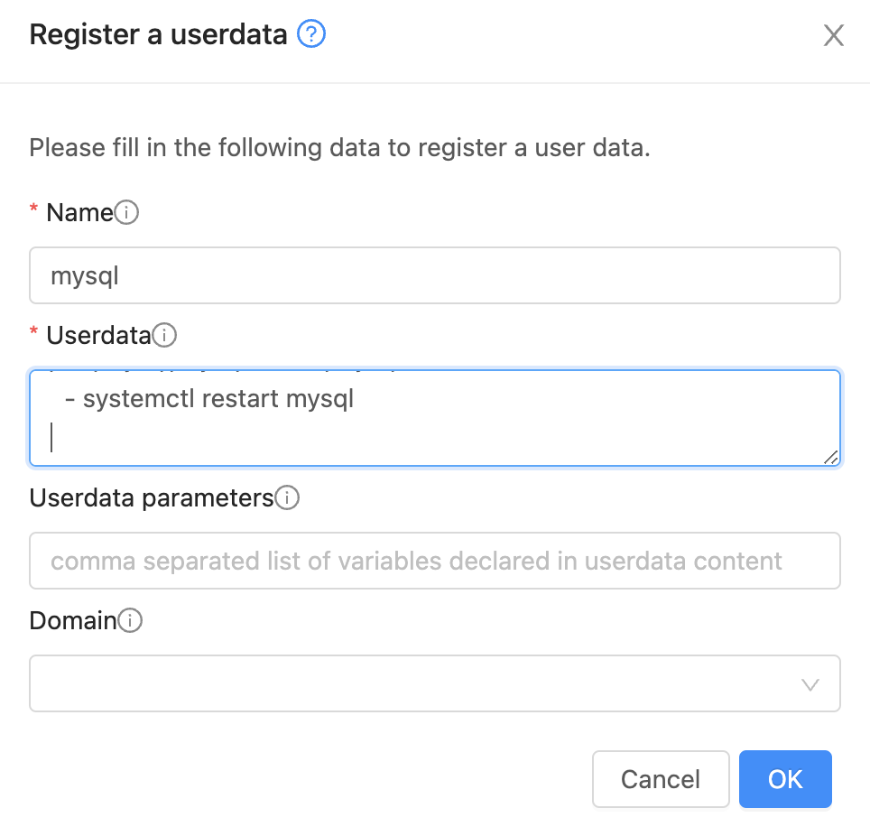

# User Data

Uma forma simples e leve de inicializar a configuração de instâncias é através do _cloud-init_, que lê configurações de [user data](https://cloudinit.readthedocs.io/en/latest/reference/examples.html) configuradas no _cloud provider_.

As imagens padrão do CloudStack já vêm com o _cloud-init_ configurado. Basta criar _user datas_
e associá-los às instâncias desejadas.

## Criação de User Data

Clique em __User Data__, __Register a userdata +__. Dê o nome de _mysql_ e conteúdo:

```yaml
#cloud-config
timezone: America/Sao_Paulo
package_update: true
package_upgrade: true

packages:
  - mysql-server
  - unattended-upgrades

write_files:
  - path: /etc/apt/apt.conf.d/99auto-upgrades-reboot
    content: |
      Unattended-Upgrade::Automatic-Reboot "true";
      Unattended-Upgrade::Automatic-Reboot-Time "02:00";

runcmd:
  - systemctl restart unattended-upgrades
  - sed -i 's/^bind-address.*=.*127.0.0.1/bind-address = 0.0.0.0/' /etc/mysql/mysql.conf.d/mysqld.cnf
  - systemctl restart mysql
```


O efeito do _user data_ acima é, na instalação do servidor:

- configurar o fuso de São Paulo
- atualizar o banco de dados do `apt` e executar `apt upgrade` 
- instalar os pacotes `mysql-server` e `unattended-upgrades`
- habilitar _reboot_ automático em upgrades, se necessário
- habilitar o _MySQL_ a atender requsições externas

Ou seja, para instâncias que utilizem este _user data_ será provisionado um servidor de banco de dados MySQL com atualizações automáticas.

Leia a [documentação](https://cloudinit.readthedocs.io/en/latest/reference/examples.html) para entender todas as opções disponíveis.