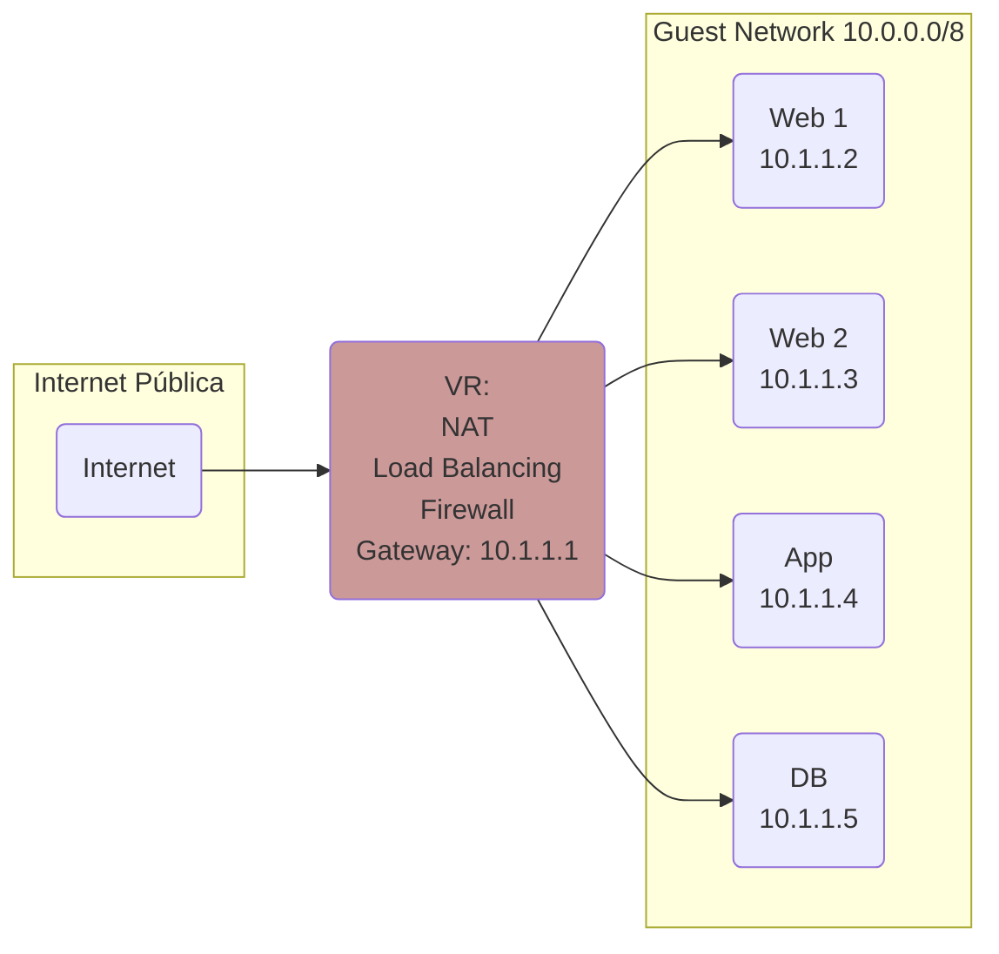
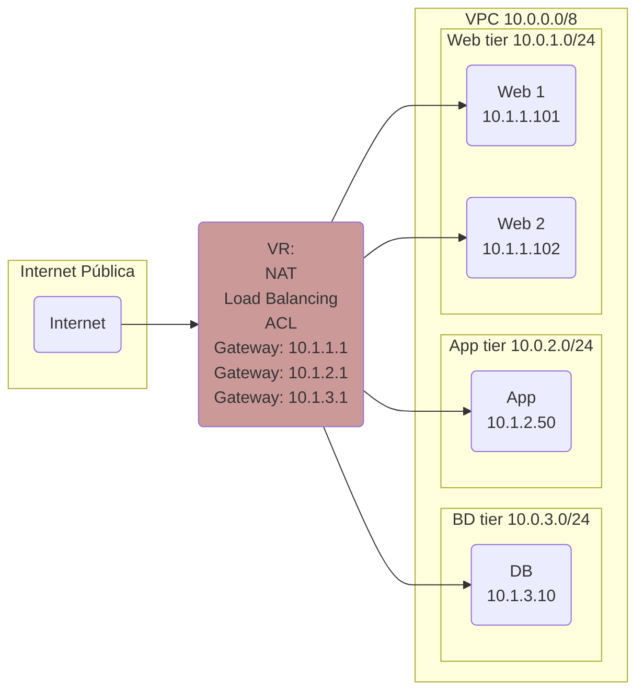
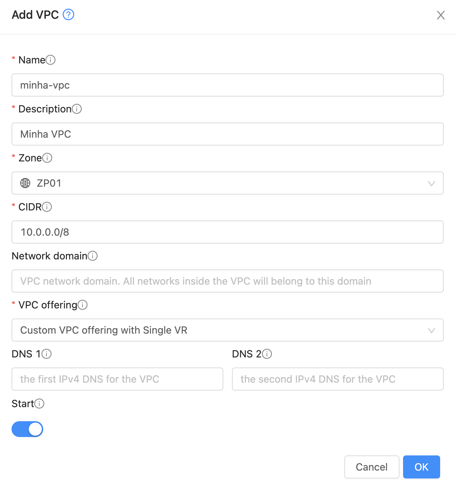
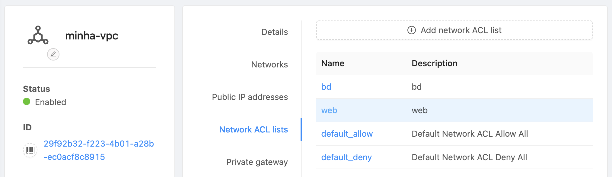
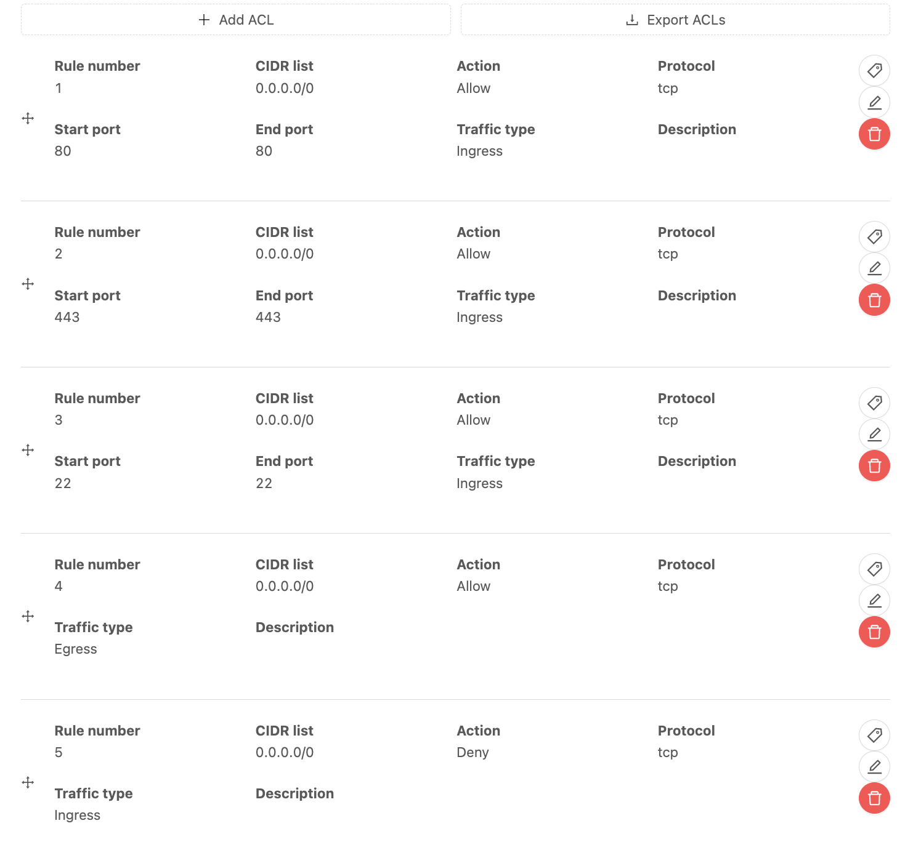
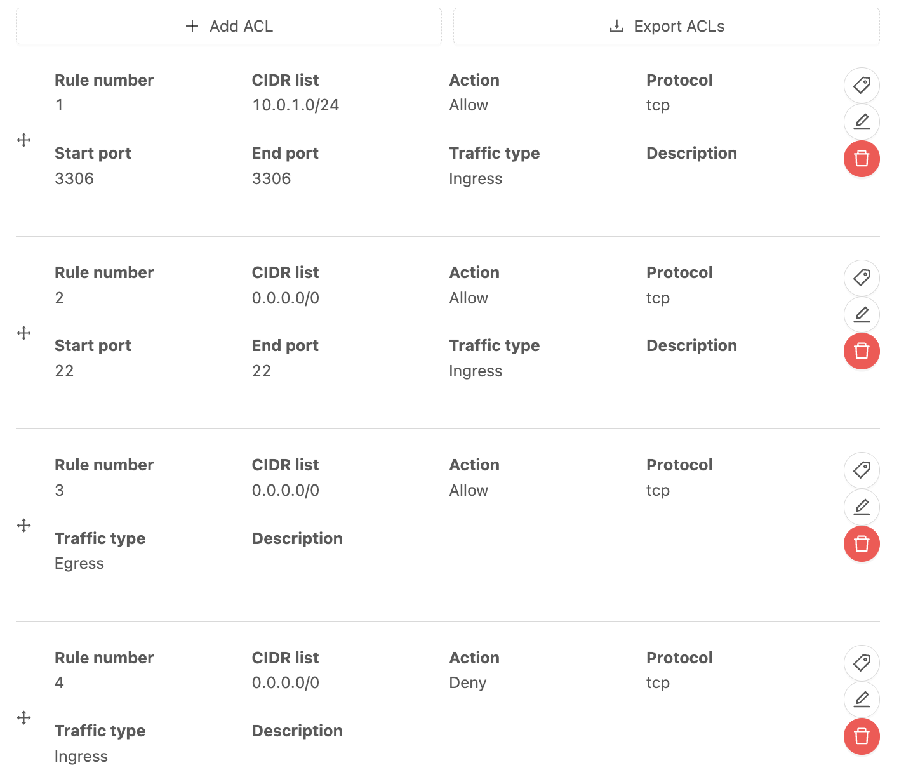
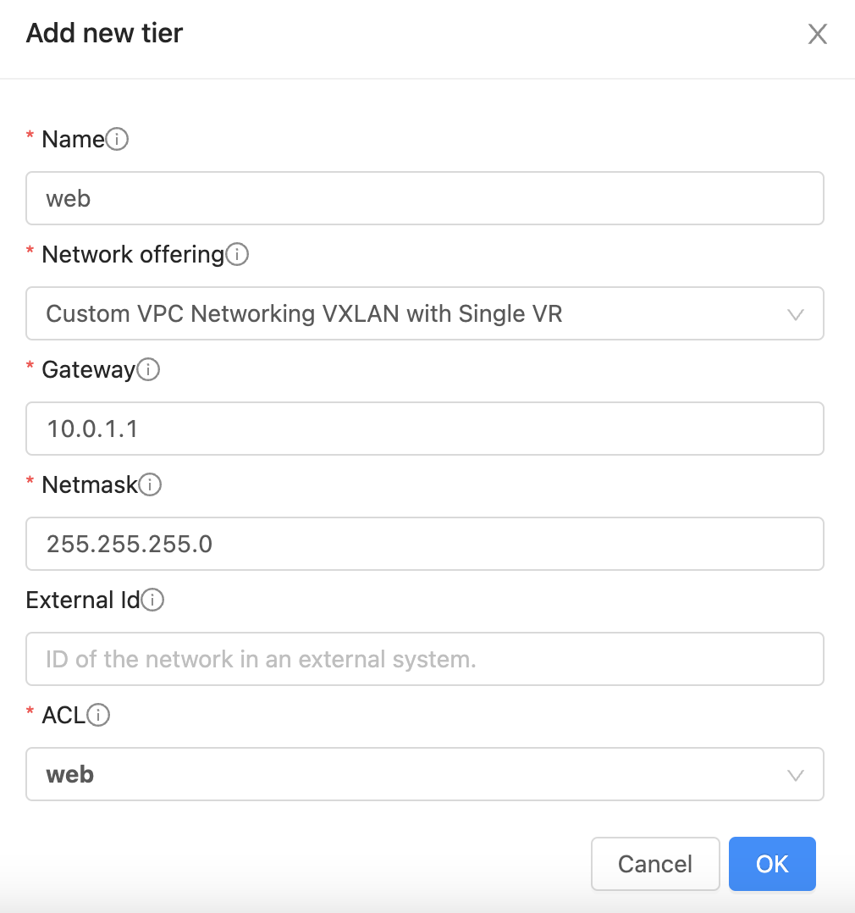
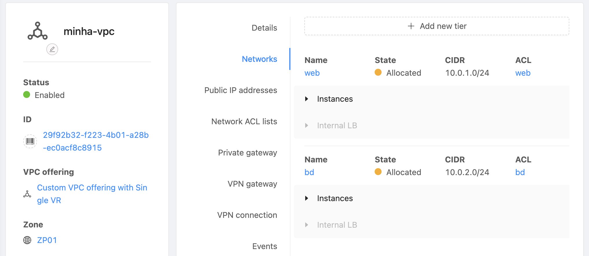
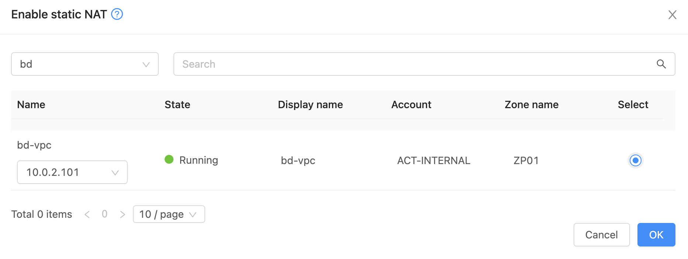

# VPC

## Introdução

Os diagramas abaixo resumem as principais diferenças entre _Guest Networks_, conceito que viemos utilizando até aqui, e _VPC_, que introduziremos nesta seção.

### Guest Network



### VPC



Em resumo:

- Enquanto numa _Guest Network_ há apenas um segmento de rede, com visibilidade irrestrita entre as _VMs_, numa _VPC_ é possível segmentar a rede entre diferentes _tiers_.
- Na _Guest Network_ utilizamos _Firewalls_ para cada IP. Na _VPC_ as regras de acesso são definidas via _ACLs_ (_Access Control Lists_) entre as _tiers_ e entre estas e a internet pública.

!!! Tip
    Todos os demais recursos descritos anteriormente como _User Data_, _Templates_, _Shapshots_, _Load Balancing_ e _Autoscaling_ funcionam normalmente em _VPCs_.
  
Neste tutorial criaremos um ambiente com duas _tiers_, _web_ e _bd_. Resumo dos passos:

- Criar _VPC_
- Criar _ACLs_
- Criar _tiers_ alocando as respectivas _ACLs_
- Criar instâncias em cada _tier_
- Mapear IPs públicos às instâncias

## Criar VPC

Acesse __Network__, __VPC__, __Add VPC +__ preenchendo:

- __Name__: _minha-vpc_
- __Description__: _Minha VPC_
- __CIDR__: _10.0.0.0/8_



## Criar ACLs

Em __Network__, __VPC__ clique sobre _minha-vpc_, __Network ACL lists__ e __Add network ACL list__.

Crie duas _ACL lists_ com nomes _web_ e _bd_. Descrições podem ser iguais aos nomes.

### ACL para Web

1. Clique sobre a _ACL_ _web_:

2. Selecione __ACL list rules__, __+ Add ACL__ algumas vezes para criar as regras, nesta ordem:
    1. __CIDR list__: _0.0.0.0/0_,  __Action__: _Allow_, __Start port__: _80_, __End port__: _80_, __Traffic type__: _Ingress_
    2. __CIDR list__: _0.0.0.0/0_,  __Action__: _Allow_, __Start port__: _443_, __End port__: _443_, __Traffic type__: _Ingress_
    3. __CIDR list__: _0.0.0.0/0_,  __Action__: _Allow_, __Start port__: _22_, __End port__: _22_, __Traffic type__: _Ingress_
    4. __CIDR list__: _0.0.0.0/0_,  __Action__: _Allow_, __Traffic type__: _Egress_
    5. __CIDR list__: _0.0.0.0/0_,  __Action__: _Deny_, __Traffic type__: _Ingress_

Ao final, a página mostrará:


!!! Info
    As _ACLs_ são avaliadas na ordem em que são criadas, até o primeiro _match_. Por isso, a regra de _Deny_ é a última, proibindo tráfego não coberto pelas regras anteriores.

### ACL para BD

1. Clique sobre a _ACL_ _bd_
2. Selecione __ACL list rules__, __+ Add ACL__ algumas vezes para criar as regras, nesta ordem:
    1. __CIDR list__: _10.0.1.0/24_,  __Action__: _Allow_, __Start port__: _3306_, __End port__: _3306_, __Traffic type__: _Ingress_
    2. __CIDR list__: _0.0.0.0/0_,  __Action__: _Allow_, __Start port__: _22_, __End port__: _22_, __Traffic type__: _Ingress_
    3. __CIDR list__: _0.0.0.0/0_,  __Action__: _Allow_, __Traffic type__: _Egress_
    4. __CIDR list__: _0.0.0.0/0_,  __Action__: _Deny_, __Traffic type__: _Ingress_

Ao final, a página mostrará:


!!! Info
    Na primeira regra, o bloco _10.0.1.0/24_, a partir do qual permitimos conexão para a porta 3306 (_MySQL_), será atribuído ao _tier_ _web_. Ou seja, esta é a regra que permitirá aos servidores do _tier_ _web_ conectarem-se ao _tier_ _bd_.

## Criar Tiers

### Tier Web

1. Em __Network__, __VPC__ clique sobre _minha-vpc_, __Networks__ e __+ Add new tier__.
2. Preencha com:
    1. __Name__: _web_
    2. __Gateway__: _10.0.1.1_
    3. __Netmask__: _255.255.255.0_
    4. __ACL__: _web_



### Tier BD

1. Da mesma forma, __Network__, __VPC__ clique sobre _minha-vpc_, __Networks__ e __+ Add new tier__.
2. Preencha com:
    1. __Name__: _bd_
    2. __Gateway__: _10.0.2.1_
    3. __Netmask__: _255.255.255.0_
    4. __ACL__: _bd_

Ao final, os _tiers_ criados aparecerão como:


## Criar instâncias

### Instância web

1. Clique __Compute__, __Instances__, __Add Instance +__
2. Selecione __My templates__, _To Do app_
3. Em __Compute offering__ escolha __micro__
4. Em __Networks__ selecione _web_, na VPC _Minha VPC_
5. Em __SSH key pairs__ selecione _minha-chave_
6. No nome coloque _web-vpc_

### Instância BD

1. Clique __Compute__, __Instances__, __Add Instance +__
2. Selecione __Community__, _Ubuntu Server 22.04_
3. Em __Compute offering__ escolha __micro__
4. Em __Networks__ selecione _bd_, na VPC _Minha VPC_
5. Em __SSH key pairs__ selecione _minha-chave_
6. Em __Advanced mode__, habilite __Show advanced settings__ e selecione _mysql_ no __Stored Userdata__
7. No nome coloque _bd-vpc_

## Mapear IPs

### Instância web

Mapearemos um IP público para possibilitar o acesso à instância _web-vpc_. De acrodo com a _ACL_ criada, serão aceitas conexões nas portas 22 (_SSH_) e 80/443 (_HTTP/HTTPS_).

1. Selecione __Network__, __VPC__, _minha-vpc_, __Public IP addresses__ e __+ Acquire new IP__. Anote o IP a ser usado para a instância _web-vpc_: `xIP_WEB_VPCx`
2. Clique sobre o IP _xIP_WEB_VPCx_ 
3. Clique sobre o botão __Enable static NAT__
4. Escolha o _tier_ _web_ e selecione a instância _web-vpc_


### Instância BD

Também mapearemos um IP público para possibilitar o acesso à instância _bd-vpc_. De acordo com a _ACL_ criada, serão aceitas conexões apenas na porta 22 (_SSH_). Note que a _ACL_ para acesso à porta 3306 (_MySQL_) só permite acesso a partir do _range_ _10.0.2.0/24_ pertentente ao _tier_ _web_, de forma que o banco permanece fechado para a internet pública.

1. Selecione __Network__, __VPC__, _minha-vpc_, __Public IP addresses__ e __+ Acquire new IP__. Anote o IP a ser usado para a instância _bd-vpc_: `xIP_BD_VPC_PUBLICx`
2. Clique sobre o IP _xIP_BD_VPC_PUBLICx_ 
3. Clique sobre o botão __Enable static NAT__
4. Escolha o _tier_ _bd_ e selecione a instância _bd-vpc_


## Configurações

### Instância web

Editaremos o _script_ `todo.php` para acessar o banco de dados no novo endereço.

1. Em __Compute__, __Instances__, selecione _bd-vpc_ e anote o IP privado: `xIP_DB_VPCx`
2. Acesse a instância _web-vpc_ via _SSH_:
```bash
ssh root@xIP_WEB_VPCx
```
3. Uma vez logado edite o arquivo:
```bash
nano /var/www/html/todo.php
```
4. Altere o endereço do banco de dados par o IP privado do banco:
```php
<?php
$user = "example_user";
$password = "xSENHA_BDx";
$database = "example_database";
$table = "todo_list";
$host = "xIP_DB_VPCx"; // Coloque o IP privado do servidor bd no CloudStack

try {
  $db = new PDO("mysql:host=$host;dbname=$database", $user, $password);
  echo "<h2>TODO</h2><ol>";
  foreach($db->query("SELECT content FROM $table") as $row) {
    echo "<li>" . $row['content'] . "</li>";
  }
  echo "</ol>";
} catch (PDOException $e) {
    print "Error!: " . $e->getMessage() . "<br/>";
    die();
}
?>
```

### Instância BD

1. Acesse a instância _bd-vpc_ via _SSH_:
```bash
ssh root@xIP_BD_VPC_PUBLICx
```
2. Verifique o término da instalação:
```bash
cloud-init status # aguarde até obter 'status: done'
systemctl status mysql # aguarde até obter status do serviço 'running'
```
3. Para configurar o banco:
```bash
mysql -u root -h localhost
```
4. Execute o _script_:
```SQL
CREATE DATABASE `example_database`;
CREATE USER 'example_user'@'%' IDENTIFIED BY 'xSENHA_BDx';
GRANT ALL PRIVILEGES ON `example_database`.* TO 'example_user'@'%';
FLUSH PRIVILEGES;
CREATE TABLE example_database.todo_list (
	item_id INT AUTO_INCREMENT,
	content VARCHAR(255),
	PRIMARY KEY(item_id)
);
USE example_database;
INSERT INTO todo_list (content) VALUES ("Minha primeira tarefa");
INSERT INTO todo_list (content) VALUES ("Minha segunda tarefa");
```

## Teste

Acesse as _URLs_ para testar:

```
http://xIP_WEB_VPCx
```

```
http://xIP_WEB_VPCx/info.php
```

```
http://xIP_WEB_VPCx/todo.php
```