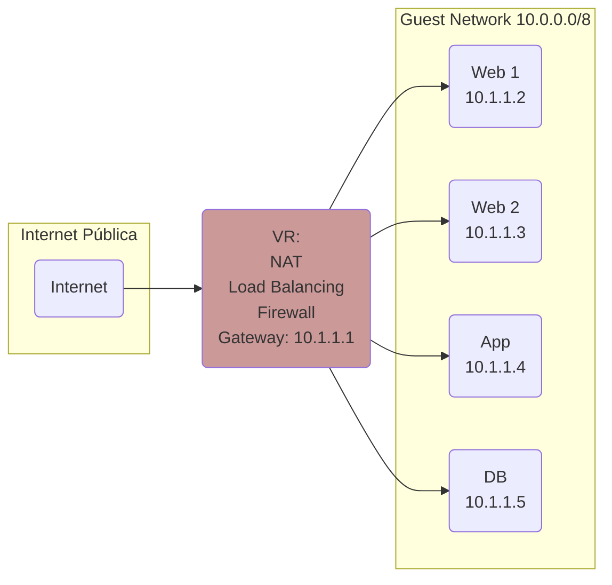
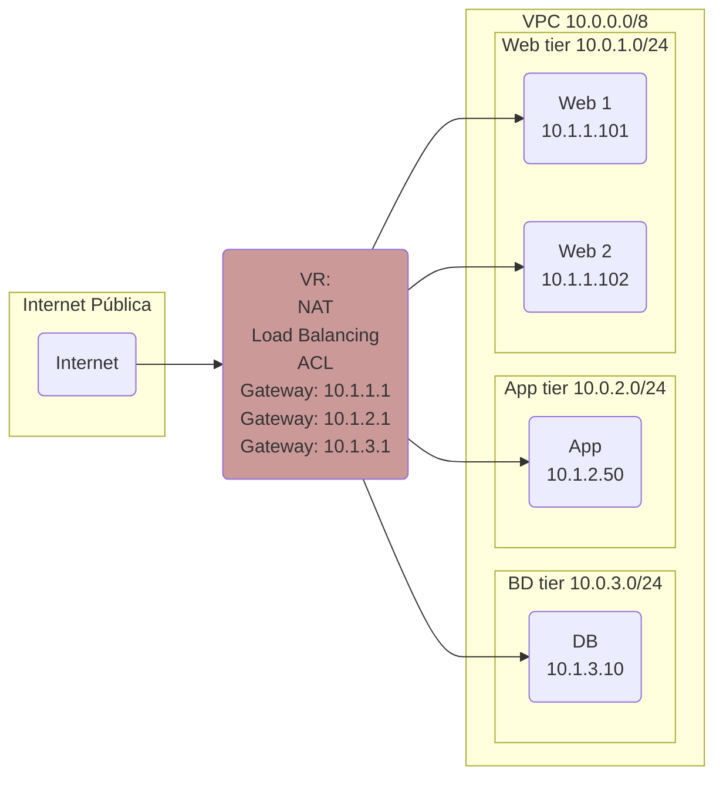

# VPC

## Introdução

Os diagramas abaixo resumem as principais diferenças entre _Guest Networks_, conceito que viemos utilizando até aqui, e _VPC_, que introduziremos nesta seção.

### Guest Network

### VPC

Em resumo:

- Enquanto numa _Guest Network_ há apenas um segmento de rede, com visibilidade irrestrita entre as _VMs_, numa _VPC_ é possível segmentar a rede entre diferentes _tiers_.
- Na _Guest Network_ utilizamos _Firewalls_ para cada IP. Na _VPC_ as regras de acesso são definidas via _ACLs_ (_Access Control Lists_) entre as _tiers_ e entre estas e a internet pública.
  
Neste tutorial criaremos um ambiente com duas _tiers_, _web_ e _bd_. Resumo dos passos:

- Criar _VPC_
- Criar _tiers_
- Criar _ACLs_
- Alocar _ACLs_ nas respectivas _tiers_
- Criar instâncias em cada _tier_
- Mapear IPs públicos às instâncias
- Criar _load balancer_ e _autoscaling group_

## Criar VPC

