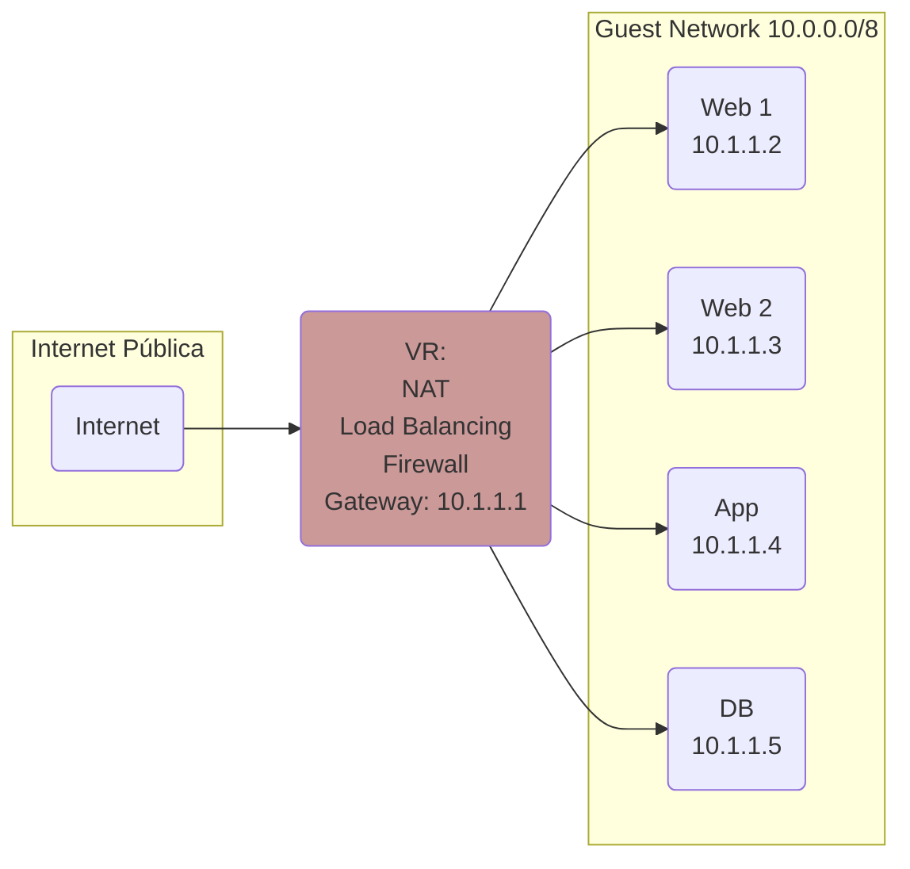
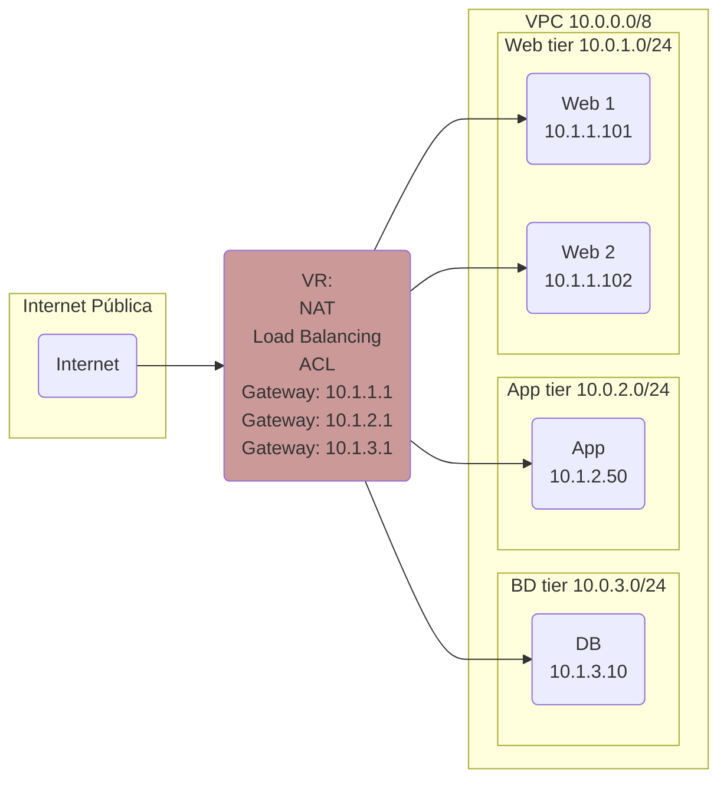

# VPC

## Introdução

Os diagramas abaixo resumem as principais diferenças entre _Guest Networks_, conceito que viemos utilizando até aqui, e _VPC_, que introduziremos nesta seção.

### Guest Network

### VPC

Em resumo:

- Enquanto numa _Guest Network_ há apenas um segmento de rede, com visibilidade irrestrita entre as _VMs_, numa _VPC_ é possível segmentar a rede entre diferentes _tiers_.
- Na _Guest Network_ utilizamos _Firewalls_ para cada IP. Na _VPC_ as regras de acesso são definidas via _ACLs_ (_Access Control Lists_) entre as _tiers_ e entre estas e a internet pública.

!!! Tip
    Todos os demais recursos descritos anteriormente como _User Data_, _Templates_, _Shapshots_, _Load Balancing_ e _Autoscaling_ funcionam normalmente em _VPCs_.
  
Neste tutorial criaremos um ambiente com duas _tiers_, _web_ e _bd_. Resumo dos passos:

- Criar _VPC_
- Criar _ACLs_
- Criar _tiers_ alocando as respectivas _ACLs_
- Criar instâncias em cada _tier_
- Mapear IPs públicos às instâncias

## Criar VPC

Acesse __Network__, __VPC__, __Add VPC +__ preenchendo:

- __Name__: _minha-vpc_
- __Description__: _Minha VPC_
- __CIDR__: _10.0.0.0/8_

## Criar ACLs

Em __Network__, __VPC__ clique sobre _minha-vpc_, __Network ACL lists__ e __Add network ACL list__.

Crie duas _ACL lists_ com nomes _web_ e _bd_. Descrições podem ser iguais aos nomes.

### ACL para Web

1. Clique sobre a _ACL_ _web_:

2. Selecione __ACL list rules__, __+ Add ACL__ algumas vezes para criar as regras, nesta ordem:
    1. __CIDR list__: _0.0.0.0/0_,  __Action__: _Allow_, __Start port__: _80_, __End port__: _80_, __Traffic type__: _Ingress_
    2. __CIDR list__: _0.0.0.0/0_,  __Action__: _Allow_, __Start port__: _443_, __End port__: _443_, __Traffic type__: _Ingress_
    3. __CIDR list__: _0.0.0.0/0_,  __Action__: _Allow_, __Start port__: _22_, __End port__: _22_, __Traffic type__: _Ingress_
    4. __CIDR list__: _0.0.0.0/0_,  __Action__: _Allow_, __Traffic type__: _Egress_
    5. __CIDR list__: _0.0.0.0/0_,  __Action__: _Deny_, __Traffic type__: _Ingress_

Ao final, a página mostrará:

!!! Info
    As _ACLs_ são avaliadas na ordem em que são criadas, até o primeiro _match_. Por isso, a regra de _Deny_ é a última, proibindo tráfego não coberto pelas regras anteriores.

### ACL para BD

1. Clique sobre a _ACL_ _bd_
2. Selecione __ACL list rules__, __+ Add ACL__ algumas vezes para criar as regras, nesta ordem:
    1. __CIDR list__: _10.0.1.0/24_,  __Action__: _Allow_, __Start port__: _3306_, __End port__: _3306_, __Traffic type__: _Ingress_
    2. __CIDR list__: _0.0.0.0/0_,  __Action__: _Allow_, __Start port__: _22_, __End port__: _22_, __Traffic type__: _Ingress_
    3. __CIDR list__: _0.0.0.0/0_,  __Action__: _Allow_, __Traffic type__: _Egress_
    4. __CIDR list__: _0.0.0.0/0_,  __Action__: _Deny_, __Traffic type__: _Ingress_

Ao final, a página mostrará:

!!! Info
    Na primeira regra, o bloco _10.0.1.0/24_, a partir do qual permitimos conexão para a porta 3306 (_MySQL_), será atribuído ao _tier_ _web_. Ou seja, esta é a regra que permitirá aos servidores do _tier_ _web_ conectarem-se ao _tier_ _bd_.

## Criar Tiers

### Tier Web

1. Em __Network__, __VPC__ clique sobre _minha-vpc_, __Networks__ e __+ Add new tier__.
2. Preencha com:
    1. __Name__: _web_
    2. __Gateway__: _10.0.1.1_
    3. __Netmask__: _255.255.255.0_
    4. __ACL__: _web_

### Tier BD

1. Da mesma forma, __Network__, __VPC__ clique sobre _minha-vpc_, __Networks__ e __+ Add new tier__.
2. Preencha com:
    1. __Name__: _bd_
    2. __Gateway__: _10.0.2.1_
    3. __Netmask__: _255.255.255.0_
    4. __ACL__: _bd_

Ao final, os _tiers_ criados aparecerão como:

